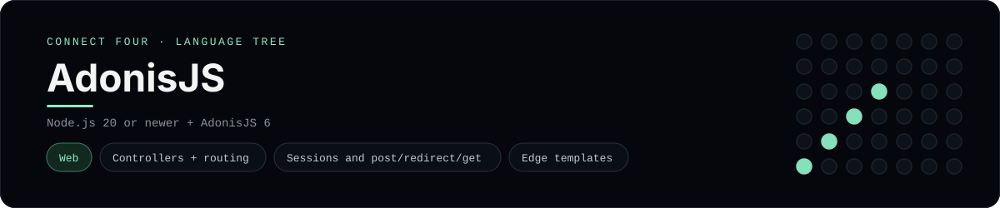

# AdonisJS Implementation

A small AdonisJS app that plays Connect Four in the browser - a
[framework showcase](../../README.md) alongside the console implementations in
[`languages/`](../../languages). AdonisJS is a batteries-included Node.js
framework, so this app serves HTML instead of the byte-for-byte stdin/stdout
console protocol, and the dashboard shows one representative file from it
rather than a single source file.

## Prerequisites

* **Toolchain:** Node.js 20 or newer
* **Check it is installed:** `node --version`

| Platform | Install command |
| --- | --- |
| Windows | `winget install OpenJS.NodeJS` |
| macOS | `brew install node` |
| Debian/Ubuntu | `apt-get install nodejs` |

## How to run

Everything the app needs is under `frameworks/adonisjs/`; run it from that
folder:

```sh
cd frameworks/adonisjs
npm install
node ace serve --hmr
```

Then open <http://localhost:3333> and play - the board is a 6x7 grid whose
bottom row is the first to fill, and the first player to line up four `X`s or
`O`s wins.

## How the game is built

* **Board** - `app/services/board.ts` is a `ConnectFourBoard` class with the 6x7
  rules: `drop`, `isFull`, `winner` and `lowestEmptyRow`. Both diagonals are
  checked from every cell, matching the win detection the console
  implementations use. It encodes itself to a string so it can live in the
  session.
* **Controller** - `app/controllers/games_controller.ts` has `show`, `move` and
  `reset` actions. The board is read from the session, mutated, and written
  back before redirecting (post/redirect/get).
* **Routes + view** - `start/routes.ts` maps the paths to those actions, and
  `resources/views/game/board.edge` is the Edge template that renders the grid.

## Skills demonstrated

* AdonisJS controllers, routing and session handling
* TypeScript service classes and path aliases (`#services/*`)
* Edge templating with `@each` and `@if`
* An array-of-arrays board with diagonal win detection

## Where the full app lives

The dashboard shows the controller, `app/controllers/games_controller.ts`, and
links the whole folder on GitHub. Everything the app needs is under
`frameworks/adonisjs/`:

```
frameworks/adonisjs/
  app/services/board.ts
  app/controllers/games_controller.ts
  start/routes.ts
  resources/views/game/board.edge
  package.json
```

The showcase dashboard shows this framework's representative file when you
open the **Frameworks** browse mode, addressable at `index.html?lang=adonisjs`.
