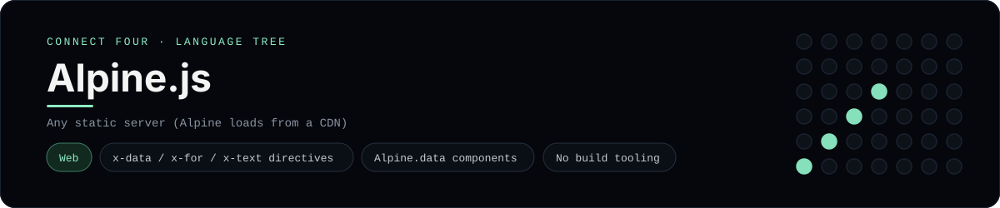

# Alpine.js Implementation

A small Alpine.js page that plays Connect Four in the browser - a
[framework showcase](../../README.md) alongside the console implementations in
[`languages/`](../../languages). Alpine is a lightweight, HTML-first reactive
library, so this app binds state with `x-` attributes instead of the
byte-for-byte stdin/stdout console protocol, and the dashboard shows one
representative file from it rather than a single source file.

## Prerequisites

* **Toolchain:** Any static file server (Alpine loads from a CDN)
* **Check it is installed:** `node --version` (for `npx serve`)

| Platform | Install command |
| --- | --- |
| Windows | `winget install OpenJS.NodeJS` |
| macOS | `brew install node` |
| Debian/Ubuntu | `apt-get install nodejs` |

## How to run

Everything the app needs is under `frameworks/alpinejs/`; run it from that
folder:

```sh
cd frameworks/alpinejs
npx serve .
```

Then open the printed URL and play - the board is a 6x7 grid whose bottom row
is the first to fill, and the first player to line up four `X`s or `O`s wins.
Alpine comes from a CDN, so there is no build step.

## How the game is built

* **Board** - `board.js` is plain JavaScript with the 6x7 rules: `drop`,
  `isColumnFull`, `winner` and `lowestEmptyRow`. Both diagonals are checked
  from every cell, matching the win detection the console implementations use.
* **Component** - `app.js` registers the `connectFour` component on
  `alpine:init` through `Alpine.data`, exposing the board, getters for the
  status and a `play`/`reset` pair.
* **Markup** - `index.html` drives the page entirely with `x-data`, `x-for`,
  `x-text`, `x-bind` and `@click`, so the HTML is the source of truth.

## Skills demonstrated

* Alpine directives (`x-data`, `x-for`, `x-text`, `:class`, `@click`)
* `Alpine.data` components with getters for derived state
* Declarative rendering with no build tooling
* An array-of-arrays board with diagonal win detection

## Where the full app lives

The dashboard shows the page, `index.html`, and links the whole folder on
GitHub. Everything the app needs is under `frameworks/alpinejs/`:

```
frameworks/alpinejs/
  index.html
  app.js
  board.js
  package.json
```

The showcase dashboard shows this framework's representative file when you
open the **Frameworks** browse mode, addressable at `index.html?lang=alpinejs`.
