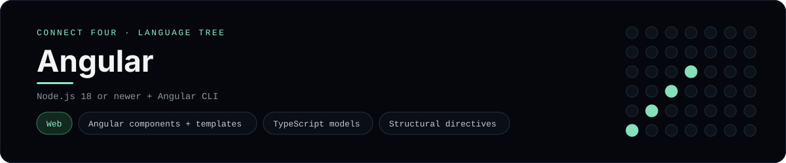

# Angular Implementation

A small Angular app that plays Connect Four in the browser - a
[framework showcase](../../README.md) alongside the console implementations in
[`languages/`](../../languages). Angular is a UI framework, so this app renders
components in the browser instead of the byte-for-byte stdin/stdout console
protocol, and the dashboard shows one representative file from it rather than a
single source file.

## Prerequisites

* **Toolchain:** Node.js 18 or newer and the Angular CLI
* **Check it is installed:** `node --version` and `ng version`

| Platform | Install command |
| --- | --- |
| Windows | `npm install -g @angular/cli` |
| macOS | `npm install -g @angular/cli` |
| Debian/Ubuntu | `npm install -g @angular/cli` |

## How to run

Generate an Angular workspace and drop the app files into it (the app is a
slice, so the scaffolding comes from the CLI):

```sh
ng new connectfour --standalone --style=css
cp -r frameworks/angular/src/. connectfour/src/
cd connectfour && ng serve
```

Then open <http://localhost:4200> and play - the board is a 6x7 grid whose
bottom row is the first to fill, and the first player to line up four `X`s or
`O`s wins.

## How the game is built

* **Board** - `src/app/connect-four/board.ts` is plain TypeScript with the 6x7
  rules: `drop`, `isColumnFull`, `winner` and `lowestEmptyRow`. Every update
  returns a fresh board, and both diagonals are checked from every cell,
  matching the win detection the console implementations use.
* **Component** - `src/app/connect-four/connect-four.component.ts` is a
  standalone component that holds the board and move count and derives the
  `status`, `over` and `champion` getters used by the template.
* **Template** - `src/app/connect-four/connect-four.component.html` uses `*ngFor`
  for the board rows and the column buttons, and `[ngClass]` / `[disabled]` for
  the cell colours and full columns.
* **Entry** - `src/main.ts` bootstraps the component with
  `bootstrapApplication`.

## Skills demonstrated

* Standalone Angular components and `@Component` metadata
* Structural directives (`*ngFor`) and property bindings (`[ngClass]`, `[disabled]`)
* Typed game state in TypeScript (union cell type)
* An array-of-arrays board with diagonal win detection

## Where the full app lives

The dashboard shows the component
`src/app/connect-four/connect-four.component.ts`, and links the whole folder on
GitHub. Everything the app needs is under `frameworks/angular/`:

```
frameworks/angular/
  src/app/connect-four/board.ts
  src/app/connect-four/connect-four.component.ts
  src/app/connect-four/connect-four.component.html
  src/app/connect-four/connect-four.component.css
  src/main.ts
```

The showcase dashboard shows this framework's representative file when you
open the **Frameworks** browse mode, addressable at `index.html?lang=angular`.
