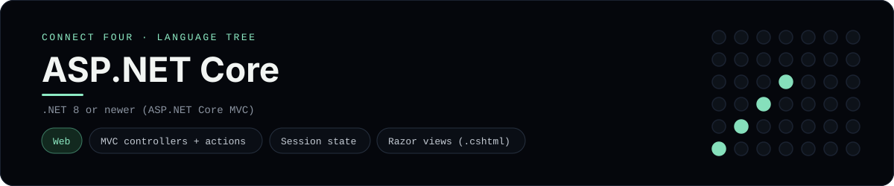

# ASP.NET Core Implementation

A small ASP.NET Core MVC app that plays Connect Four in the browser - a
[framework showcase](../../README.md) alongside the console implementations in
[`languages/`](../../languages). ASP.NET Core is the web framework inside .NET,
so this app serves server-rendered Razor views instead of the byte-for-byte
stdin/stdout console protocol, and the dashboard shows one representative file
from it rather than a single source file.

## Prerequisites

* **Toolchain:** the .NET SDK 8 or newer
* **Check it is installed:** `dotnet --version`

| Platform | Install command |
| --- | --- |
| Windows | `winget install Microsoft.DotNet.SDK.8` |
| macOS | `brew install dotnet-sdk` |
| Debian/Ubuntu | `apt-get install dotnet-sdk-8.0` |

## How to run

Generate an MVC project and drop the app files into it (the app is a slice, so
the scaffolding comes from the template):

```sh
dotnet new mvc -o connectfour
cp frameworks/aspnetcore/Program.cs connectfour/
cp -r frameworks/aspnetcore/Controllers/. connectfour/Controllers/
cp -r frameworks/aspnetcore/Models/. connectfour/Models/
cp -r frameworks/aspnetcore/Views/. connectfour/Views/
cd connectfour && dotnet run
```

Then open the printed address (usually <http://localhost:5000>) and play - the
board is a 6x7 grid whose bottom row is the first to fill, and the first player
to line up four `X`s or `O`s wins.

## How the game is built

* **Model** - `Models/ConnectFourBoard.cs` holds the 6x7 board and the rules:
  `Drop`, `IsFull`, `Winner`, `IsOver` and `HasLine`, plus `Serialize` /
  `Deserialize` so it can round-trip through the session. Both diagonals are
  checked from every cell, matching the win detection the console
  implementations use.
* **Controller** - `Controllers/GameController.cs` keeps the board in the
  session, validates the chosen column, applies the move and redirects back
  (post/redirect/get) with `RedirectToAction`, so a refresh never re-plays a
  move. The POST actions are `[ValidateAntiForgeryToken]`.
* **Views** - `Views/Game/Board.cshtml` is a Razor view that renders the board
  (top row first) and the column buttons; the form tag helper adds the
  antiforgery token.
* **Host** - `Program.cs` registers MVC and session and maps the default
  `{controller=Game}/{action=Board}` route.

## Skills demonstrated

* ASP.NET Core MVC: models, controllers, actions and Razor views
* Session state and post/redirect/get with `RedirectToAction`
* `[ValidateAntiForgeryToken]` and Razor form tag helpers
* A 2D array board with diagonal win detection

## Where the full app lives

The dashboard shows the controller, `Controllers/GameController.cs`, and links
the whole folder on GitHub. Everything the app adds is under
`frameworks/aspnetcore/`:

```
frameworks/aspnetcore/
  Models/ConnectFourBoard.cs
  Controllers/GameController.cs
  Views/Game/Board.cshtml
  Program.cs
```

The showcase dashboard shows this framework's representative file when you
open the **Frameworks** browse mode, addressable at `index.html?lang=aspnetcore`.
