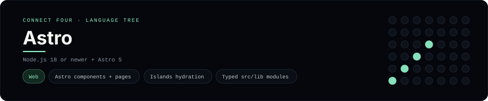

# Astro Implementation

A small Astro app that plays Connect Four in the browser - a
[framework showcase](../../README.md) alongside the console implementations in
[`languages/`](../../languages). Astro is a content-first web framework, so this
app ships static HTML with a small client script instead of the byte-for-byte
stdin/stdout console protocol, and the dashboard shows one representative file
from it rather than a single source file.

## Prerequisites

* **Toolchain:** Node.js 18 or newer
* **Check it is installed:** `node --version`

| Platform | Install command |
| --- | --- |
| Windows | `winget install OpenJS.NodeJS` |
| macOS | `brew install node` |
| Debian/Ubuntu | `apt-get install nodejs` |

## How to run

Everything the app needs is under `frameworks/astro/`; run it from that folder:

```sh
cd frameworks/astro
npm install
npm run dev
```

Then open the printed <http://localhost:4321> and play - the board is a 6x7
grid whose bottom row is the first to fill, and the first player to line up
four `X`s or `O`s wins.

## How the game is built

* **Board** - `src/lib/board.ts` is plain TypeScript with the 6x7 rules:
  `drop`, `isColumnFull`, `winner` and `lowestEmptyRow`. Every update returns a
  fresh board, and both diagonals are checked from every cell, matching the win
  detection the console implementations use.
* **Component** - `src/components/ConnectFour.astro` renders the static shell
  and a hydrated `<script>` that owns the board state and rebuilds the grid on
  every move.
* **Page** - `src/pages/index.astro` is the file-based route that mounts the
  component, with `astro.config.mjs` keeping the output static.

## Skills demonstrated

* Astro components, file-based routing and islands hydration
* Typed TypeScript board logic in a `src/lib` module
* Server-rendered HTML with a progressive client script
* An array-of-arrays board with diagonal win detection

## Where the full app lives

The dashboard shows the board module, `src/lib/board.ts`, and links the whole
folder on GitHub. Everything the app needs is under `frameworks/astro/`:

```
frameworks/astro/
  src/lib/board.ts
  src/components/ConnectFour.astro
  src/pages/index.astro
  astro.config.mjs
  package.json
```

The showcase dashboard shows this framework's representative file when you
open the **Frameworks** browse mode, addressable at `index.html?lang=astro`.
