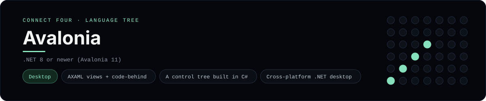

# Avalonia Implementation

A small Avalonia app that plays Connect Four as a cross-platform desktop window
- a [framework showcase](../../README.md) alongside the console implementations
in [`languages/`](../../languages). Avalonia is a cross-platform .NET UI
framework, so this app draws native controls instead of the byte-for-byte
stdin/stdout console protocol, and the dashboard shows one representative file
from it rather than a single source file.

## Prerequisites

* **Toolchain:** .NET 8 or newer
* **Check it is installed:** `dotnet --version`

| Platform | Install command |
| --- | --- |
| Windows | `winget install Microsoft.DotNet.SDK.8` |
| macOS | `brew install dotnet-sdk` |
| Debian/Ubuntu | `apt-get install dotnet-sdk-8.0` |

## How to run

Everything the app needs is under `frameworks/avalonia/`; run it from that
folder:

```sh
cd frameworks/avalonia
dotnet run
```

A desktop window opens - the board is a 6x7 grid whose bottom row is the first
to fill, and the first player to line up four `X`s or `O`s wins.

## How the game is built

* **Board** - `Board.cs` is a `ConnectFourBoard` with the 6x7 rules: `Drop`,
  `IsFull`, `Winner` and `LowestEmptyRow`. Both diagonals are checked from every
  cell, matching the win detection the console implementations use.
* **Window** - `MainWindow.axaml.cs` is the code-behind: it builds the disc grid
  from `Border` controls, the column buttons, and the status line, and rebuilds
  them on every move. `MainWindow.axaml` holds the layout shell.

## Skills demonstrated

* Avalonia XAML views with code-behind
* Building a control tree in C# (`Border`, `StackPanel`, `Button`)
* `StackPanel` layout and `CornerRadius` disc rendering
* A 2-D array board with diagonal win detection

## Where the full app lives

The dashboard shows the code-behind, `MainWindow.axaml.cs`, and links the whole
folder on GitHub. Everything the app needs is under `frameworks/avalonia/`:

```
frameworks/avalonia/
  Board.cs
  MainWindow.axaml
  MainWindow.axaml.cs
  App.axaml
  App.axaml.cs
  Program.cs
  ConnectFour.csproj
```

The showcase dashboard shows this framework's representative file when you
open the **Frameworks** browse mode, addressable at `index.html?lang=avalonia`.
