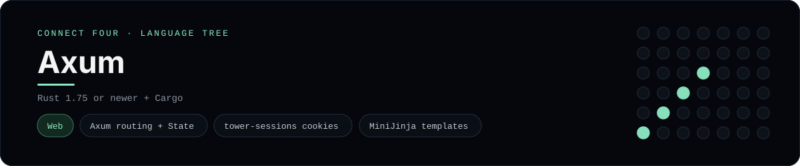

# Axum Implementation

A small Axum app that plays Connect Four in the browser - a
[framework showcase](../../README.md) alongside the console implementations in
[`languages/`](../../languages). Axum is an async Rust web framework, so this
app serves HTML instead of the byte-for-byte stdin/stdout console protocol, and
the dashboard shows one representative file from it rather than a single source
file.

## Prerequisites

* **Toolchain:** Rust 1.75 or newer with Cargo
* **Check it is installed:** `cargo --version`

| Platform | Install command |
| --- | --- |
| Windows | `winget install Rustlang.Rustup` |
| macOS | `brew install rust` |
| Debian/Ubuntu | `apt-get install cargo` |

## How to run

Everything the app needs is under `frameworks/axum/`; run it from that folder:

```sh
cd frameworks/axum
cargo run
```

Then open <http://localhost:3000> and play - the board is a 6x7 grid whose
bottom row is the first to fill, and the first player to line up four `X`s or
`O`s wins.

## How the game is built

* **Board** - `src/board.rs` is a `serde`-serialisable `ConnectFourBoard` with
  the 6x7 rules: `drop`, `is_full`, `winner` and `lowest_empty_row`. Both
  diagonals are checked from every cell, matching the win detection the console
  implementations use.
* **App** - `src/main.rs` wires an Axum `Router` of `GET /`, `POST /move` and
  `POST /reset`. The board lives in a `tower-sessions` cookie session, and every
  handler renders the page through MiniJinja and redirects back
  (post/redirect/get).
* **Template** - `templates/board.html` renders the grid and the column
  buttons, and announces whose turn it is or who won.

## Skills demonstrated

* Axum routing, extractors and shared `State`
* Async Rust with Tokio and `tower-sessions`
* Serde-backed session state and MiniJinja templates
* A `Vec<Vec<String>>` board with diagonal win detection

## Where the full app lives

The dashboard shows the app entry point, `src/main.rs`, and links the whole
folder on GitHub. Everything the app needs is under `frameworks/axum/`:

```
frameworks/axum/
  src/board.rs
  src/main.rs
  templates/board.html
  Cargo.toml
```

The showcase dashboard shows this framework's representative file when you
open the **Frameworks** browse mode, addressable at `index.html?lang=axum`.
