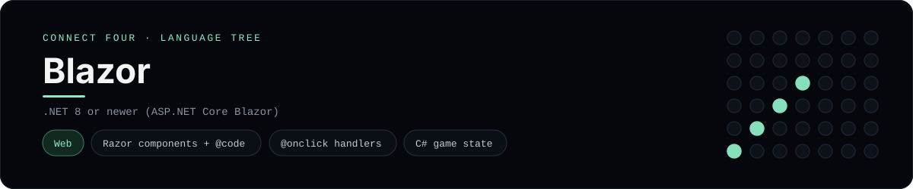

# Blazor Implementation

A small Blazor app that plays Connect Four in the browser - a
[framework showcase](../../README.md) alongside the console implementations in
[`languages/`](../../languages). Blazor is part of ASP.NET Core, so this app
renders Razor components with C# instead of the byte-for-byte stdin/stdout
console protocol, and the dashboard shows one representative file from it rather
than a single source file.

## Prerequisites

* **Toolchain:** the .NET SDK 8 or newer (Blazor ships with ASP.NET Core)
* **Check it is installed:** `dotnet --version`

| Platform | Install command |
| --- | --- |
| Windows | `winget install Microsoft.DotNet.SDK.8` |
| macOS | `brew install dotnet-sdk` |
| Debian/Ubuntu | `apt-get install dotnet-sdk-8.0` |

## How to run

Generate a Blazor project and drop the app files into it (the app is a slice,
so the scaffolding comes from the template):

```sh
dotnet new blazor -o connectfour
cp frameworks/blazor/ConnectFourBoard.cs connectfour/
cp frameworks/blazor/Components/Pages/ConnectFour.razor connectfour/Components/Pages/
cd connectfour && dotnet run
```

Then open the printed address (usually <http://localhost:5000>) and play - the
board is a 6x7 grid whose bottom row is the first to fill, and the first player
to line up four `X`s or `O`s wins.

## How the game is built

* **Board** - `ConnectFourBoard.cs` holds the 6x7 board and the rules: `Drop`,
  `IsFull`, `Winner`, `IsOver` and `HasLine`. Both diagonals are checked from
  every cell, matching the win detection the console implementations use.
* **Component** - `Components/Pages/ConnectFour.razor` is a routed Razor
  component (`@page "/"`): its markup renders the board (top row first) and the
  column buttons, and its `@code` block holds the game state, a computed
  `Status`, and the `Play` / `Reset` handlers bound with `@onclick`.

## Skills demonstrated

* Razor components with an `@code` block and `@page` routing
* C# event handling with `@onclick` and captured loop variables
* A 2D array board with diagonal win detection
* Computed properties driving the rendered markup

## Where the full app lives

The dashboard shows the component, `Components/Pages/ConnectFour.razor`, and
links the whole folder on GitHub. Everything the app adds is under
`frameworks/blazor/`:

```
frameworks/blazor/
  ConnectFourBoard.cs
  Components/Pages/ConnectFour.razor
```

The showcase dashboard shows this framework's representative file when you
open the **Frameworks** browse mode, addressable at `index.html?lang=blazor`.
