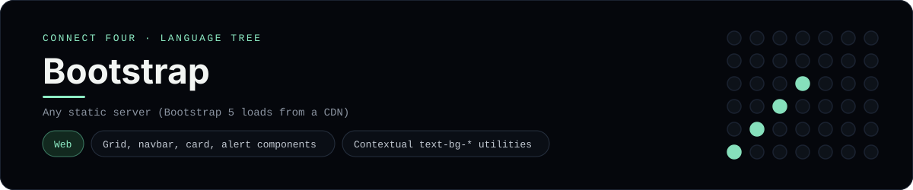

# Bootstrap Implementation

A small Bootstrap 5 page that plays Connect Four in the browser - a
[framework showcase](../../README.md) alongside the console implementations in
[`languages/`](../../languages). Bootstrap is a component/utility CSS framework,
so this app styles and builds a static page instead of the byte-for-byte
stdin/stdout console protocol, and the dashboard shows one representative file
from it rather than a single source file.

## Prerequisites

* **Toolchain:** Any static file server (Bootstrap loads from a CDN)
* **Check it is installed:** `node --version` (for `npx serve`)

| Platform | Install command |
| --- | --- |
| Windows | `winget install OpenJS.NodeJS` |
| macOS | `brew install node` |
| Debian/Ubuntu | `apt-get install nodejs` |

## How to run

Everything the app needs is under `frameworks/bootstrap/`; run it from that
folder:

```sh
cd frameworks/bootstrap
npx serve .
```

Then open the printed URL and play - the board is a 6x7 grid whose bottom row is
the first to fill, and the first player to line up four discs wins. Bootstrap's
CSS and JS bundle come from a CDN, so there is no build step.

## How the game is built

* **Markup** - `index.html` is built entirely from Bootstrap components and
  utilities: a `navbar`, an `alert` for the status line, a `badge` for the move
  count, a `card` around the board, a `btn-group` for the column buttons and
  `d-grid`/`btn` for the reset button.
* **Logic** - `src/game.js` is plain JavaScript with the 6x7 board rules; it
  paints each disc as a `rounded-circle` `text-bg-*` span and swaps the alert's
  contextual class (`alert-info`/`alert-success`/`alert-warning`) as the game
  progresses. Both diagonals are checked from every cell.

## Skills demonstrated

* Bootstrap grid, navbar, card, alert, badge and button components
* Contextual utilities (`text-bg-*`, `d-flex`, `rounded-circle`, `shadow-sm`)
* The Bootstrap JS bundle and dark theme (`data-bs-theme="dark"`)
* An array-of-arrays board with diagonal win detection

## Where the full app lives

The dashboard shows the page, `index.html`, and links the whole folder on
GitHub. Everything the app needs is under `frameworks/bootstrap/`:

```
frameworks/bootstrap/
  index.html
  src/game.js
  package.json
```

The showcase dashboard shows this framework's representative file when you
open the **Frameworks** browse mode, addressable at `index.html?lang=bootstrap`.
