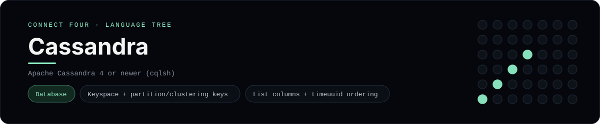

# Apache Cassandra (CQL) Implementation

A pure-CQL Connect Four that stores games in Apache Cassandra - a
[framework showcase](../../README.md) alongside the console implementations in
[`languages/`](../../languages). Cassandra is a wide-column NoSQL database, so
this app answers with result sets instead of the byte-for-byte stdin/stdout
console protocol, and the dashboard shows one representative file from it rather
than a single source file.

## Prerequisites

* **Toolchain:** Apache Cassandra 4 or newer (or a compatible service) with
  `cqlsh`
* **Check it is installed:** `cqlsh --version`

| Platform | Install command |
| --- | --- |
| Windows | run Cassandra in Docker: `docker run --name cassandra -p 9042:9042 cassandra:4` |
| macOS | `brew install cassandra` |
| Debian/Ubuntu | install Apache Cassandra from the official apt repo, or use Docker |

## How to run

Everything the app needs is under `frameworks/cassandra/`; run the scripts with
`cqlsh`:

```sh
cd frameworks/cassandra
cqlsh -f schema.cql
cqlsh -f seed.cql
cqlsh -f queries.cql
```

The seed plays a horizontal win for `X` across the bottom row of the board, so
the final `SELECT` prints all seven columns.

## How the game is built

* **Schema** - `schema.cql` creates a keyspace with `NetworkTopologyStrategy`,
  then models a game as a `games` row (partition keyed by `game_id`), one
  `moves_by_game` row per turn (clustered by a `timeuuid`) and one
  `board_by_game` row per column holding a `list<text>` of discs. Everything
  carries `default_time_to_live`, plus a materialized view and a secondary index.
* **Queries** - `queries.cql` starts a game, reserves the next turn with a
  lightweight transaction (`IF next_turn = …`, whose `[applied]` column decides
  the winner), appends a disc with `discs = discs + ['X']`, logs the move and
  reads the board, the move slice and the view.
* **Seed** - `seed.cql` appends a full winning line so the reads return
  immediately.

## Skills demonstrated

* Keyspace creation and a query-driven data model (partition + clustering keys)
* A `list<text>` column updated by append, and `timeuuid` ordering
* Lightweight transactions for turn ownership, plus TTLs
* Materialized views and secondary indexes

## Where the full app lives

The dashboard shows the schema, `schema.cql`, and links the whole folder on
GitHub. Everything the app needs is under `frameworks/cassandra/`:

```
frameworks/cassandra/
  schema.cql
  queries.cql
  seed.cql
```

The showcase dashboard shows this framework's representative file when you
open the **Frameworks** browse mode, addressable at
`index.html?lang=cassandra`.
