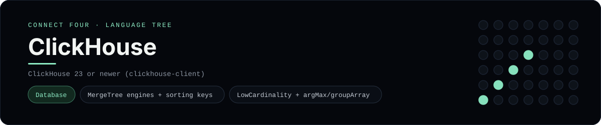

# ClickHouse Implementation

A pure-ClickHouse schema and analytic query set for Connect Four - a
[framework showcase](../../README.md) alongside the console implementations in
[`languages/`](../../languages). ClickHouse is a column-oriented OLAP database,
so it answers with result sets instead of the byte-for-byte stdin/stdout console
protocol, and the dashboard shows one representative file from it rather than a
single source file.

## Prerequisites

* **Toolchain:** ClickHouse 23 or newer (the `clickhouse-client`, or
  `clickhouse local`)
* **Check it is installed:** `clickhouse-client --version`

| Platform | Install command |
| --- | --- |
| Windows | ClickHouse in Docker: `docker run --name clickhouse -p 8123:8123 -p 9000:9000 clickhouse/clickhouse-server` |
| macOS | `brew install clickhouse` |
| Debian/Ubuntu | `apt-get install clickhouse-client clickhouse-server` |

## How to run

Everything the app needs is under `frameworks/clickhouse/`; run it from that
folder:

```sh
cd frameworks/clickhouse
clickhouse-client --multiquery < schema.sql
clickhouse-client --multiquery < queries.sql
```

`queries.sql` inserts a game and its moves, then prints the per-column heights,
the disc lists and the join result.

## How the game is built

* **Schema** - `schema.sql` creates `MergeTree` tables sorted by their primary
  key, with `UUID` game ids, `LowCardinality(String)` player names (a real
  ClickHouse optimisation) and a `SummingMergeTree` **materialized view** that
  keeps per-column totals incrementally.
* **Queries** - `queries.sql` uses `argMax(player, turn_no)` for the top disc and
  last turn per column, `groupArray(player)` for each column's discs, and an
  `ANY LEFT JOIN` to attach the most recent move to each game.

## Skills demonstrated

* `MergeTree` engines and sorting keys
* `LowCardinality` types and `UUID` keys
* `argMax`, `groupArray` and `group by` aggregation
* Materialized views with `SummingMergeTree` and `ANY LEFT JOIN`

## Where the full app lives

The dashboard shows the schema, `schema.sql`, and links the whole folder on
GitHub. Everything the app needs is under `frameworks/clickhouse/`:

```
frameworks/clickhouse/
  schema.sql
  queries.sql
```

The showcase dashboard shows this framework's representative file when you
open the **Frameworks** browse mode, addressable at
`index.html?lang=clickhouse`.
