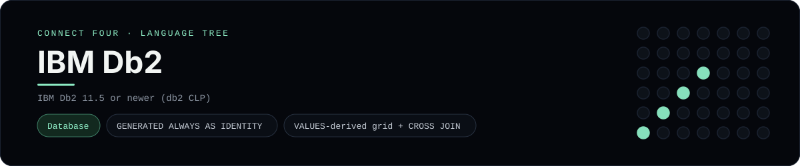

# IBM Db2 Implementation

A pure-Db2 schema and query set for Connect Four - a
[framework showcase](../../README.md) alongside the console implementations in
[`languages/`](../../languages). Db2 is a relational database, so it answers with
result sets instead of the byte-for-byte stdin/stdout console protocol, and the
dashboard shows one representative file from it rather than a single source file.

## Prerequisites

* **Toolchain:** IBM Db2 11.5 or newer with the `db2` command-line processor
  (Db2 Community Edition runs in a container)
* **Check it is installed:** `db2 --version`

| Platform | Install command |
| --- | --- |
| Windows | Db2 Community Edition in Docker: `docker run --name db2 -p 50000:50000 -e LICENSE=accept -e DB2INST1_PASSWORD=... ibmcom/db2` |
| macOS | Db2 Community Edition in Docker (same image) |
| Debian/Ubuntu | Db2 Community Edition in Docker (same image) |

## How to run

Everything the app needs is under `frameworks/db2/`; run the scripts with the
Db2 command-line processor:

```sh
cd frameworks/db2
db2 -tvf schema.sql
db2 -tvf seed.sql
db2 -tvf queries.sql
```

The seed plays a horizontal win for `X` in the bottom row, so `queries.sql`
prints the rendered board.

## How the game is built

* **Schema** - `schema.sql` models a game as a `games` row plus one `moves` row
  per turn, using `GENERATED ALWAYS AS IDENTITY` keys, `VARCHAR`/`CHAR`
  columns, foreign/unique/CHECK constraints, an index and a `cells` view that
  numbers each disc with `ROW_NUMBER() OVER (...)`.
* **Seed** - `seed.sql` inserts one game and seven moves.
* **Queries** - `queries.sql` renders the grid with a `VALUES`-derived table
  `CROSS JOIN`ed into a grid, left-joined to `cells` and collapsed with
  `LISTAGG(...) WITHIN GROUP (ORDER BY ...)`, then scans for runs of four with
  `GROUP BY ... HAVING` and `FETCH FIRST n ROWS ONLY`.

## Skills demonstrated

* Db2 identity columns, constraints and index design
* `VALUES`-derived tables and `CROSS JOIN` grid construction
* `LISTAGG ... WITHIN GROUP` ordered aggregation
* `FETCH FIRST n ROWS ONLY` row limiting

## Where the full app lives

The dashboard shows the schema, `schema.sql`, and links the whole folder on
GitHub. Everything the app needs is under `frameworks/db2/`:

```
frameworks/db2/
  schema.sql
  seed.sql
  queries.sql
```

The showcase dashboard shows this framework's representative file when you
open the **Frameworks** browse mode, addressable at `index.html?lang=db2`.
