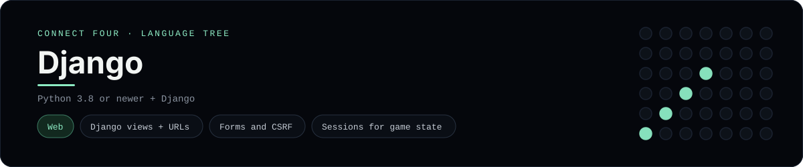

# Django Implementation

A small Django app that plays Connect Four in the browser - a
[framework showcase](../../README.md) alongside the console implementations in
[`languages/`](../../languages). Django is a web framework, so this app serves
HTML instead of the byte-for-byte stdin/stdout console protocol, and the
dashboard shows one representative file from it rather than a single source
file.

## Prerequisites

* **Toolchain:** Python 3.8 or newer and Django
* **Check it is installed:** `python --version` and `python -m django --version`

| Platform | Install command |
| --- | --- |
| Windows | `pip install django` |
| macOS | `pip install django` |
| Debian/Ubuntu | `pip install django` |

## How to run

Generate a Django project and drop the `game` app into it (the app is a slice,
so the scaffolding comes from `django-admin`):

```sh
django-admin startproject connectfour
cp -r frameworks/django/game connectfour/game
```

Then wire it up in `connectfour/settings.py` (add `"game"` to `INSTALLED_APPS`)
and `connectfour/urls.py`:

```python
from django.urls import include, path

urlpatterns = [
    path("", include("game.urls")),
]
```

Finally run it:

```sh
cd connectfour && python manage.py runserver
```

Then open <http://localhost:8000> and play - the board is a 6x7 grid whose
bottom row is the first to fill, and the first player to line up four `X`s or
`O`s wins.

## How the game is built

* **Board** - `game/board.py` holds the 6x7 board and the rules: `drop`,
  `is_full`, `winner`, `is_over` and `has_line`. It serialises to and from plain
  lists so it can live in the session, and both diagonals are checked from every
  cell, matching the win detection the console implementations use.
* **Views** - `game/views.py` keeps the game in the session, validates the
  chosen column through a form, applies the move and redirects back
  (post/redirect/get), so a refresh never re-plays a move.
* **Forms** - `game/forms.py` exposes the column as an `IntegerField` bounded to
  `1..7`, so Django validates it before the board is touched.
* **URLs** - `game/urls.py` names the board, `move/` and `reset/` routes as one
  `game` app.
* **Template** - `game/templates/game/board.html` renders the board and a row of
  column buttons; the status line announces whose turn it is or who won.

## Skills demonstrated

* Django views, URLconfs and named routes
* Forms, `csrf_token` and post/redirect/get
* Sessions for game state, a `reversed` template loop
* A list-of-lists board with diagonal win detection

## Where the full app lives

The dashboard shows the views, `game/views.py`, and links the whole folder on
GitHub. Everything the app needs is under `frameworks/django/`:

```
frameworks/django/
  game/board.py
  game/forms.py
  game/views.py
  game/urls.py
  game/templates/game/board.html
```

The showcase dashboard shows this framework's representative file when you
open the **Frameworks** browse mode, addressable at `index.html?lang=django`.
