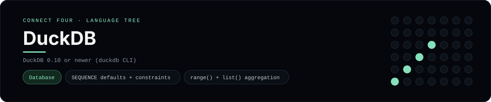

# DuckDB Implementation

A pure-DuckDB schema and analytic query set for Connect Four - a
[framework showcase](../../README.md) alongside the console implementations in
[`languages/`](../../languages). DuckDB is an in-process analytical database, so
it answers with result sets instead of the byte-for-byte stdin/stdout console
protocol, and the dashboard shows one representative file from it rather than a
single source file.

## Prerequisites

* **Toolchain:** DuckDB 0.10 or newer (the `duckdb` CLI or the Python package)
* **Check it is installed:** `duckdb --version`

| Platform | Install command |
| --- | --- |
| Windows | `winget install DuckDB.cli` |
| macOS | `brew install duckdb` |
| Debian/Ubuntu | download the CLI from duckdb.org, or `pip install duckdb` |

## How to run

Everything the app needs is under `frameworks/duckdb/`; run it from that folder:

```sh
cd frameworks/duckdb
duckdb connect_four.duckdb < schema.sql
duckdb connect_four.duckdb < seed.sql
duckdb connect_four.duckdb < queries.sql
```

The seed plays a horizontal win for `X` in the bottom row, so `queries.sql`
prints the rendered board and the pivot.

## How the game is built

* **Schema** - `schema.sql` uses a `SEQUENCE` for move ids, foreign/unique/CHECK
  constraints and a `cells` view that numbers discs with `row_number() OVER (...)`.
* **Seed** - `seed.sql` bulk-loads the moves from a `VALUES` table.
* **Queries** - `queries.sql` builds the grid with `range()` tables and
  `list(... ORDER BY ...)`, reshapes it with DuckDB's `PIVOT ... ON ... USING`,
  and detects a run of four with window `count(*) OVER (...)` across rows,
  columns and both diagonal offsets.

## Skills demonstrated

* DuckDB `SEQUENCE` defaults and standard constraints
* `range()` table functions and ordered `list()` aggregation
* `PIVOT ... ON ... USING` for reshaping
* Window-function run detection across four lines

## Where the full app lives

The dashboard shows the schema, `schema.sql`, and links the whole folder on
GitHub. Everything the app needs is under `frameworks/duckdb/`:

```
frameworks/duckdb/
  schema.sql
  seed.sql
  queries.sql
```

The showcase dashboard shows this framework's representative file when you
open the **Frameworks** browse mode, addressable at `index.html?lang=duckdb`.
