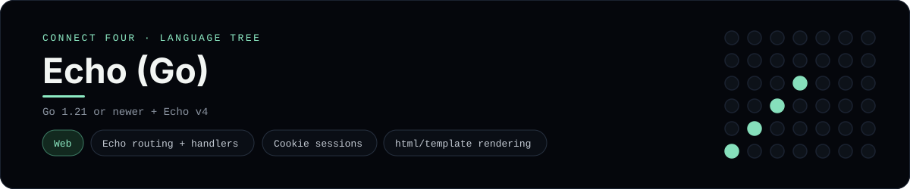

# Echo Implementation

A small Echo app that plays Connect Four in the browser - a
[framework showcase](../../README.md) alongside the console implementations in
[`languages/`](../../languages). Echo is a high-performance Go web framework, so
this app serves HTML instead of the byte-for-byte stdin/stdout console protocol,
and the dashboard shows one representative file from it rather than a single
source file.

## Prerequisites

* **Toolchain:** Go 1.21 or newer
* **Check it is installed:** `go version`

| Platform | Install command |
| --- | --- |
| Windows | `winget install GoLang.Go` |
| macOS | `brew install go` |
| Debian/Ubuntu | `apt-get install golang-go` |

## How to run

Everything the app needs is under `frameworks/echo/`; run it from that folder:

```sh
cd frameworks/echo
go mod tidy
go run .
```

Then open <http://localhost:8080> and play - the board is a 6x7 grid whose
bottom row is the first to fill, and the first player to line up four `X`s or
`O`s wins.

## How the game is built

* **Board** - `board/board.go` is a JSON-serialisable `ConnectFourBoard` with the
  6x7 rules: `Drop`, `IsFull`, `Winner` and `lowestEmptyRow`. Both diagonals are
  checked from every cell, matching the win detection the console
  implementations use.
* **App** - `main.go` builds an Echo server with a custom `TemplateRenderer`,
  the `echo-contrib` session middleware over a cookie store, and routes for
  `GET /`, `POST /move` and `POST /reset`. Every mutation redirects back
  (post/redirect/get).

## Skills demonstrated

* Echo routing, middleware and custom renderers
* Cookie sessions with `echo-contrib`
* `html/template` rendering with maps and ranges
* A struct-of-arrays board with diagonal win detection

## Where the full app lives

The dashboard shows the app, `main.go`, and links the whole folder on GitHub.
Everything the app needs is under `frameworks/echo/`:

```
frameworks/echo/
  board/board.go
  main.go
  templates/board.html
  go.mod
```

The showcase dashboard shows this framework's representative file when you
open the **Frameworks** browse mode, addressable at `index.html?lang=echo`.
