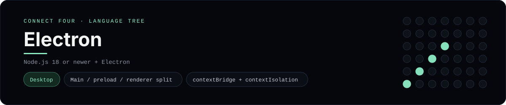

# Electron Implementation

A small Electron app that plays Connect Four as a desktop window - a
[framework showcase](../../README.md) alongside the console implementations in
[`languages/`](../../languages). Electron wraps a web page in a native shell, so
this app renders HTML in a Chromium window instead of the byte-for-byte
stdin/stdout console protocol, and the dashboard shows one representative file
from it rather than a single source file.

## Prerequisites

* **Toolchain:** Node.js 18 or newer
* **Check it is installed:** `node --version`

| Platform | Install command |
| --- | --- |
| Windows | `winget install OpenJS.NodeJS` |
| macOS | `brew install node` |
| Debian/Ubuntu | `apt-get install nodejs` |

## How to run

Everything the app needs is under `frameworks/electron/`; run it from that
folder:

```sh
cd frameworks/electron
npm install
npm start
```

A desktop window opens - the board is a 6x7 grid whose bottom row is the first
to fill, and the first player to line up four `X`s or `O`s wins.

## How the game is built

* **Main** - `main.js` is the Electron main process: it creates a `BrowserWindow`
  with `contextIsolation` on and loads `index.html`.
* **Preload** - `preload.js` exposes a tiny `appInfo` object through
  `contextBridge`, which is the safe way to reach Node from the renderer.
* **Renderer** - `renderer.js` is the page's JavaScript with the 6x7 board
  logic (`drop`, `isColumnFull`, `winner`, `lowestEmptyRow`); both diagonals are
  checked from every cell, matching the console implementations.

## Skills demonstrated

* Electron main/preload/renderer split and `BrowserWindow`
* `contextBridge` + `contextIsolation` security defaults
* A desktop app with no server at all
* An array-of-arrays board with diagonal win detection

## Where the full app lives

The dashboard shows the main process, `main.js`, and links the whole folder on
GitHub. Everything the app needs is under `frameworks/electron/`:

```
frameworks/electron/
  main.js
  preload.js
  renderer.js
  index.html
  package.json
```

The showcase dashboard shows this framework's representative file when you
open the **Frameworks** browse mode, addressable at `index.html?lang=electron`.
