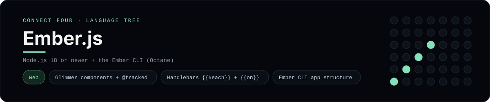

# Ember.js Implementation

A small Ember Octane app that plays Connect Four in the browser - a
[framework showcase](../../README.md) alongside the console implementations in
[`languages/`](../../languages). Ember is a convention-driven web framework, so
this app renders components in the browser instead of the byte-for-byte
stdin/stdout console protocol, and the dashboard shows one representative file
from it rather than a single source file.

## Prerequisites

* **Toolchain:** Node.js 18 or newer + the Ember CLI
* **Check it is installed:** `node --version` and `ember --version`

| Platform | Install command |
| --- | --- |
| Windows | `winget install OpenJS.NodeJS` then `npm install -g ember-cli` |
| macOS | `brew install node` then `npm install -g ember-cli` |
| Debian/Ubuntu | `apt-get install nodejs` then `npm install -g ember-cli` |

## How to run

Everything the app needs is under `frameworks/ember/`; run it from that folder:

```sh
cd frameworks/ember
npm install
npm start
```

Then open the printed <http://localhost:4200> and play - the board is a 6x7 grid
whose bottom row is the first to fill, and the first player to line up four
`X`s or `O`s wins.

## How the game is built

* **Component** - `app/components/connect-four.js` is a Glimmer component: the
  board and move count are `@tracked`, `rows`/`columns`/`status` are getters
  that recompute on change, and `play`/`reset` are `@action`s.
* **Board** - `app/utils/board.js` is the pure 6x7 rules engine (`drop`,
  `isColumnFull`, `winner`, `lowestEmptyRow`); both diagonals are checked from
  every cell, matching the console implementations.
* **Template** - `app/templates/components/connect-four.hbs` renders the grid
  with `{{#each}}`, the `{{on "click"}}` modifier and the `fn` helper; the app
  entry is `app/app.js` with `config/environment.js`.

## Skills demonstrated

* Ember Octane Glimmer components with `@tracked` and `@action`
* Handlebars templates, `{{#each}}` and the `{{on}}`/`fn` helpers
* The Ember CLI app structure (resolver, environment config, build)
* An array-of-arrays board with diagonal win detection

## Where the full app lives

The dashboard shows the component, `app/components/connect-four.js`, and links
the whole folder on GitHub. Everything the app needs is under
`frameworks/ember/`:

```
frameworks/ember/
  app/components/connect-four.js
  app/utils/board.js
  app/templates/components/connect-four.hbs
  app/templates/application.hbs
  app/app.js
  config/environment.js
  ember-cli-build.js
  package.json
```

The showcase dashboard shows this framework's representative file when you
open the **Frameworks** browse mode, addressable at `index.html?lang=ember`.
