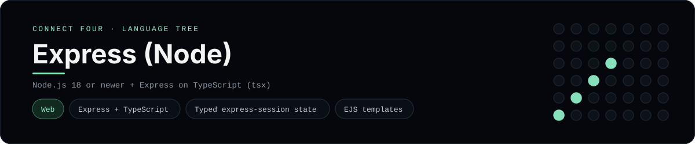

# Express Implementation

A small Express app that plays Connect Four in the browser - a
[framework showcase](../../README.md) alongside the console implementations in
[`languages/`](../../languages). Express is a Node.js web framework, so this app
serves server-rendered EJS views instead of the byte-for-byte stdin/stdout
console protocol, and the dashboard shows one representative file from it rather
than a single source file.

## Prerequisites

* **Toolchain:** Node.js 18 or newer
* **Check it is installed:** `node --version`

| Platform | Install command |
| --- | --- |
| Windows | `winget install OpenJS.NodeJS` |
| macOS | `brew install node` |
| Debian/Ubuntu | `apt-get install nodejs` |

## How to run

Everything the app needs is under `frameworks/expressjs/`; run it from that
folder:

```sh
cd frameworks/expressjs
npm init -y
npm install express express-session ejs
node app.js
```

Then open <http://localhost:3000> and play - the board is a 6x7 grid whose
bottom row is the first to fill, and the first player to line up four `X`s or
`O`s wins.

## How the game is built

* **Board** - `board.js` is plain JavaScript with the 6x7 rules: `drop`,
  `isColumnFull`, `winner` and `lowestEmptyRow`. Every update returns a fresh
  board, and both diagonals are checked from every cell, matching the win
  detection the console implementations use.
* **App** - `app.js` is the Express application: `GET /` renders the board and
  `POST /move` / `POST /reset` read and write the game through
  `express-session` and redirect back (post/redirect/get), so a refresh never
  re-plays a move.
* **View** - `views/board.ejs` is an EJS template that renders the board (top
  row first) and the column buttons.

## Skills demonstrated

* Express routing, middleware and `express.urlencoded`
* `express-session` for game state and post/redirect/get
* EJS templates
* An array-of-arrays board with diagonal win detection

## Where the full app lives

The dashboard shows the application entry point, `app.js`, and links the whole
folder on GitHub. Everything the app needs is under `frameworks/expressjs/`:

```
frameworks/expressjs/
  app.js
  board.js
  views/board.ejs
```

The showcase dashboard shows this framework's representative file when you
open the **Frameworks** browse mode, addressable at `index.html?lang=expressjs`.
