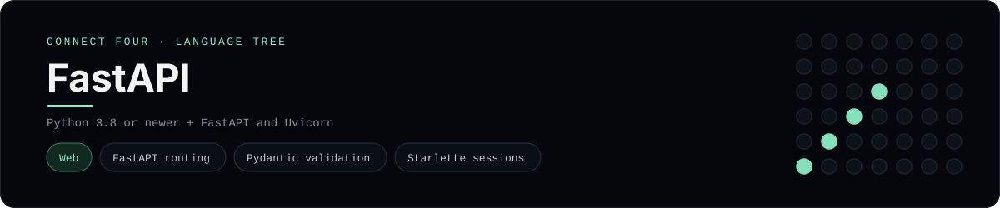

# FastAPI Implementation

A small FastAPI app that plays Connect Four in the browser - a
[framework showcase](../../README.md) alongside the console implementations in
[`languages/`](../../languages). FastAPI is a web framework, so this app serves
HTML instead of the byte-for-byte stdin/stdout console protocol, and the
dashboard shows one representative file from it rather than a single source
file.

## Prerequisites

* **Toolchain:** Python 3.8 or newer with FastAPI and Uvicorn
* **Check it is installed:** `python --version` and `python -m uvicorn --version`

| Platform | Install command |
| --- | --- |
| Windows | `pip install "fastapi[standard]"` |
| macOS | `pip install "fastapi[standard]"` |
| Debian/Ubuntu | `pip install "fastapi[standard]"` |

## How to run

Everything the app needs is under `frameworks/fastapi/`; run it from that
folder:

```sh
cd frameworks/fastapi
pip install "fastapi[standard]"
fastapi dev app/main.py
```

Then open <http://127.0.0.1:8000> and play - the board is a 6x7 grid whose
bottom row is the first to fill, and the first player to line up four `X`s or
`O`s wins. FastAPI also serves interactive docs at `/docs`.

## How the game is built

* **Board** - `app/board.py` holds the 6x7 board and the rules: `drop`,
  `is_full`, `winner`, `is_over` and `has_line`. It serialises to and from plain
  dicts so it can live in the session, and both diagonals are checked from every
  cell, matching the win detection the console implementations use.
* **App** - `app/main.py` is the FastAPI instance: a `GET /` that renders the
  board, `POST /move` and `POST /reset`, all reading and writing the game
  through Starlette's session middleware and redirecting back
  (post/redirect/get), so a refresh never re-plays a move.
* **Schemas** - `app/schemas.py` describes a move as a Pydantic model, and the
  `column` form field is bounded to `1..7` right in the signature, so FastAPI
  validates it before the board is touched.
* **Template** - `app/templates/board.html` is a Jinja2 template that renders
  the board and a row of column buttons; the status line announces whose turn
  it is or who won.

## Skills demonstrated

* FastAPI routing and typed request parsing
* Pydantic models for validation
* Starlette session middleware and Jinja2 templates
* A list-of-lists board with diagonal win detection

## Where the full app lives

The dashboard shows the app entry point, `app/main.py`, and links the whole
folder on GitHub. Everything the app needs is under `frameworks/fastapi/`:

```
frameworks/fastapi/
  app/board.py
  app/schemas.py
  app/main.py
  app/templates/board.html
```

The showcase dashboard shows this framework's representative file when you
open the **Frameworks** browse mode, addressable at `index.html?lang=fastapi`.
