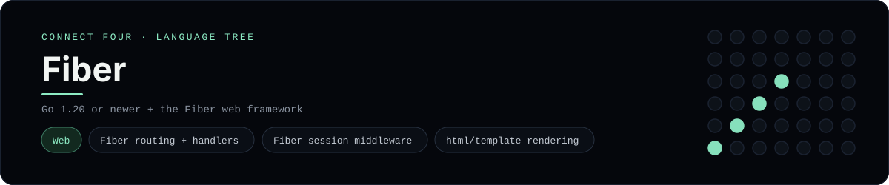

# Fiber Implementation

A small Fiber app that plays Connect Four in the browser - a
[framework showcase](../../README.md) alongside the console implementations in
[`languages/`](../../languages). Fiber is a Go web framework, so this app serves
HTML instead of the byte-for-byte stdin/stdout console protocol, and the
dashboard shows one representative file from it rather than a single source
file.

## Prerequisites

* **Toolchain:** Go 1.20 or newer
* **Check it is installed:** `go version`

| Platform | Install command |
| --- | --- |
| Windows | `winget install GoLang.Go` |
| macOS | `brew install go` |
| Debian/Ubuntu | `apt-get install golang-go` |

## How to run

Everything the app needs is under `frameworks/fiber/`; initialise the module and
pull the dependencies from that folder:

```sh
cd frameworks/fiber
go mod init connectfour
go get github.com/gofiber/fiber/v2 github.com/gofiber/template/html/v2
go run .
```

Then open <http://127.0.0.1:3000> and play - the board is a 6x7 grid whose
bottom row is the first to fill, and the first player to line up four `X`s or
`O`s wins.

## How the game is built

* **Board** - `board/board.go` holds the 6x7 board and the rules: `Drop`,
  `IsFull`, `Winner`, `IsOver` and `hasLine`. It marshals to and from JSON so it
  can live in the session, and both diagonals are checked from every cell,
  matching the win detection the console implementations use.
* **App** - `main.go` is the Fiber app: `GET /` renders the board and
  `POST /move` / `POST /reset` read and write the game through Fiber's session
  middleware and redirect back (post/redirect/get), so a refresh never re-plays
  a move.
* **Template** - `templates/board.html` is an `html/template` that renders the
  board and a row of column buttons; the status line announces whose turn it is
  or who won.

## Skills demonstrated

* Fiber routing, context and `fiber.Map`
* Fiber session middleware with JSON session state
* `html/template` rendering through the Fiber HTML engine
* An array-of-arrays board with diagonal win detection

## Where the full app lives

The dashboard shows the app entry point, `main.go`, and links the whole folder
on GitHub. Everything the app needs is under `frameworks/fiber/`:

```
frameworks/fiber/
  board/board.go
  main.go
  templates/board.html
```

The showcase dashboard shows this framework's representative file when you
open the **Frameworks** browse mode, addressable at `index.html?lang=fiber`.
