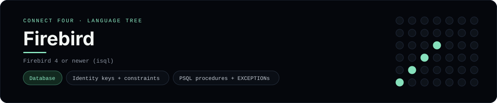

# Firebird Implementation

A pure-Firebird schema and PSQL procedures for Connect Four - a
[framework showcase](../../README.md) alongside the console implementations in
[`languages/`](../../languages). Firebird is a relational database, so it answers
with result sets instead of the byte-for-byte stdin/stdout console protocol, and
the dashboard shows one representative file from it rather than a single source
file.

## Prerequisites

* **Toolchain:** Firebird 4 or newer with `isql` (or `isql-fb`)
* **Check it is installed:** `isql -z`

| Platform | Install command |
| --- | --- |
| Windows | `winget install Firebird.Firebird` |
| macOS | `brew install firebird` |
| Debian/Ubuntu | `apt-get install firebird4.0-server` |

## How to run

Everything the app needs is under `frameworks/firebird/`; run the scripts with
`isql`:

```sh
cd frameworks/firebird
isql -user sysdba -password masterkey connect_four.fdb < schema.sql
isql -user sysdba -password masterkey connect_four.fdb < procedures.sql
isql -user sysdba -password masterkey connect_four.fdb < seed.sql
```

The seed calls `drop_disc` seven times to play a horizontal win for `X`, then
prints the board.

## How the game is built

* **Schema** - `schema.sql` models a game as a `games` row plus one `moves` row
  per turn, using `GENERATED BY DEFAULT AS IDENTITY` keys,
  foreign/unique/CHECK constraints, an index and a `cells` view with
  `ROW_NUMBER() OVER (...)`.
* **Procedures** - `procedures.sql` defines two PSQL routines: `drop_disc`
  validates the move and `EXCEPTION`s on an out-of-range or full column, and the
  selectable `board` procedure loops rows with a `WHILE` loop and aggregates each
  row with Firebird's `LIST()` aggregate.
* **Seed** - `seed.sql` drives the procedures from an `EXECUTE BLOCK`.

## Skills demonstrated

* Firebird DDL plus identity columns and constraints
* PSQL stored procedures, `EXCEPTION`s and `WHILE` loops
* Selectable procedures (`SUSPEND`) and the `LIST()` aggregate
* `EXECUTE BLOCK` for anonymous procedural blocks

## Where the full app lives

The dashboard shows the schema, `schema.sql`, and links the whole folder on
GitHub. Everything the app needs is under `frameworks/firebird/`:

```
frameworks/firebird/
  schema.sql
  procedures.sql
  seed.sql
```

The showcase dashboard shows this framework's representative file when you
open the **Frameworks** browse mode, addressable at
`index.html?lang=firebird`.
