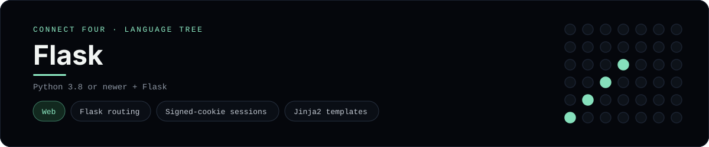

# Flask Implementation

A small Flask app that plays Connect Four in the browser - a
[framework showcase](../../README.md) alongside the console implementations in
[`languages/`](../../languages). Flask is a web framework, so this app serves
HTML instead of the byte-for-byte stdin/stdout console protocol, and the
dashboard shows one representative file from it rather than a single source
file.

## Prerequisites

* **Toolchain:** Python 3.8 or newer and Flask
* **Check it is installed:** `python --version` and `python -m flask --version`

| Platform | Install command |
| --- | --- |
| Windows | `pip install flask` |
| macOS | `pip install flask` |
| Debian/Ubuntu | `pip install flask` |

## How to run

Everything the app needs is under `frameworks/flask/`; run it from that folder:

```sh
cd frameworks/flask
pip install flask
flask --app app run --debug
```

Then open <http://127.0.0.1:5000> and play - the board is a 6x7 grid whose
bottom row is the first to fill, and the first player to line up four `X`s or
`O`s wins.

## How the game is built

* **Board** - `board.py` holds the 6x7 board and the rules: `drop`, `is_full`,
  `winner`, `is_over` and `has_line`. It serialises to and from plain dicts so
  it can live in the session, and both diagonals are checked from every cell,
  matching the win detection the console implementations use.
* **App** - `app.py` is the Flask instance: `GET /` renders the board and
  `POST /move` / `POST /reset` read and write the game through Flask's signed
  session cookie and redirect back (post/redirect/get), so a refresh never
  re-plays a move.
* **Template** - `templates/board.html` is a Jinja2 template that renders the
  board and a row of column buttons; the status line announces whose turn it is
  or who won.

## Skills demonstrated

* Flask routing and the app factory-free single module
* Signed-cookie sessions and `url_for`
* Jinja2 templates and `request.form` parsing
* A list-of-lists board with diagonal win detection

## Where the full app lives

The dashboard shows the app entry point, `app.py`, and links the whole folder
on GitHub. Everything the app needs is under `frameworks/flask/`:

```
frameworks/flask/
  board.py
  app.py
  templates/board.html
```

The showcase dashboard shows this framework's representative file when you
open the **Frameworks** browse mode, addressable at `index.html?lang=flask`.
