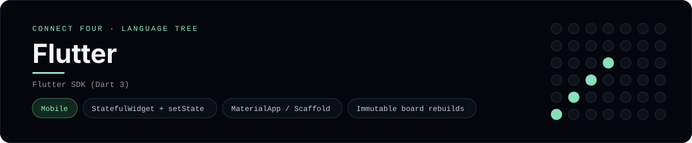

# Flutter Implementation

A small Flutter app that plays Connect Four on a phone - a
[framework showcase](../../README.md) alongside the console implementations in
[`languages/`](../../languages). Flutter is a mobile framework, so this app
renders widgets instead of the byte-for-byte stdin/stdout console protocol, and
the dashboard shows one representative file from it rather than a single source
file.

## Prerequisites

* **Toolchain:** the Flutter SDK (which bundles Dart 3)
* **Check it is installed:** `flutter --version`

| Platform | Install command |
| --- | --- |
| Windows | `winget install Google.Flutter` (or the official SDK zip) |
| macOS | `brew install --cask flutter` |
| Debian/Ubuntu | install the official Flutter SDK (`snap install flutter --classic`) |

## How to run

Generate a Flutter project and drop the app files into it (the app is a slice,
so the scaffolding comes from the CLI):

```sh
flutter create connectfour
cp frameworks/flutter/lib/main.dart connectfour/lib/main.dart
cp frameworks/flutter/lib/connect_four.dart connectfour/lib/connect_four.dart
cp frameworks/flutter/lib/board.dart connectfour/lib/board.dart
cd connectfour && flutter run
```

Then pick a device (an emulator, a simulator, or the desktop app) - the board is
a 6x7 grid whose bottom row is the first to fill, and the first player to line
up four `X`s or `O`s wins.

## How the game is built

* **Board** - `lib/board.dart` is plain Dart with the 6x7 rules: `drop`,
  `isColumnFull`, `winner` and `lowestEmptyRow`. Every update returns a fresh
  board, and both diagonals are checked from every cell, matching the win
  detection the console implementations use.
* **Widget** - `lib/connect_four.dart` is a `StatefulWidget`: its state holds
  the board and move count, `setState` applies a move, and the `build` method
  renders the grid and the column buttons with `MaterialApp` / `Scaffold`
  widgets.
* **Entry** - `lib/main.dart` wraps the widget in a `MaterialApp`.

## Skills demonstrated

* Flutter `StatefulWidget` / `State` and `setState`
* `MaterialApp`, `Scaffold` and `AppBar` composition
* Dart collection `for` in widget lists and immutable board rebuilds
* An array-of-arrays board with diagonal win detection

## Where the full app lives

The dashboard shows the widget, `lib/connect_four.dart`, and links the whole
folder on GitHub. Everything the app adds is under `frameworks/flutter/`:

```
frameworks/flutter/
  lib/main.dart
  lib/connect_four.dart
  lib/board.dart
```

The showcase dashboard shows this framework's representative file when you
open the **Frameworks** browse mode, addressable at `index.html?lang=flutter`.
