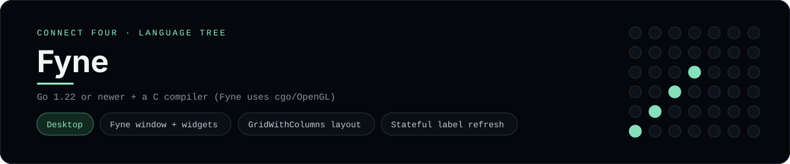

# Fyne Implementation

A small Fyne app that plays Connect Four in a native desktop window - a
[framework showcase](../../README.md) alongside the console implementations in
[`languages/`](../../languages). Fyne is a cross-platform GUI toolkit for Go, so
this app draws windows and widgets instead of serving HTML or the byte-for-byte
stdin/stdout console protocol, and the dashboard shows one representative file
from it rather than a single source file.

## Prerequisites

* **Toolchain:** Go 1.22 or newer, plus a C compiler and OpenGL headers (Fyne
  renders through cgo)
* **Check it is installed:** `go version`

| Platform | Install command |
| --- | --- |
| Windows | `winget install GoLang.Go`, plus an MSYS2/MinGW-w64 `gcc` on `PATH` |
| macOS | `brew install go` (the Xcode command-line tools provide the C compiler) |
| Debian/Ubuntu | `apt-get install golang-go gcc libgl1-mesa-dev xorg-dev` |

## How to run

Everything the app needs is under `frameworks/fyne/`; initialise the module and
pull Fyne from that folder:

```sh
cd frameworks/fyne
go mod init connectfour
go get fyne.io/fyne/v2
go run .
```

A desktop window opens - the board is a 6x7 grid whose bottom row is the first
to fill, click one of the numbered buttons to drop a piece, and the first player
to line up four `X`s or `O`s wins. `New game` clears the board.

## How the game is built

* **Board** - `board/board.go` holds the 6x7 board and the rules: `Drop`,
  `IsFull`, `Winner`, `IsOver` and `hasLine`. It marshals to and from JSON, and
  both diagonals are checked from every cell, matching the win detection the
  console implementations use.
* **App** - `main.go` is the Fyne UI: a `gameUI` owns the board and a
  `[Rows][Columns]*widget.Label` grid, `container.NewGridWithColumns` lays out
  the cells and the column buttons, and every click calls `refresh` to re-render
  the labels and the bold status line through the widgets' `SetText` methods.

## Skills demonstrated

* A Fyne `app.App` + `Window` built entirely in code
* `container.NewGridWithColumns` and `container.NewBorder` layout
* Stateful `widget.Label` / `widget.Button` updates with `SetText`
* An array-of-arrays board with diagonal win detection

## Where the full app lives

The dashboard shows the UI, `main.go`, and links the whole folder on GitHub.
Everything the app needs is under `frameworks/fyne/`:

```
frameworks/fyne/
  board/board.go
  main.go
```

The showcase dashboard shows this framework's representative file when you
open the **Frameworks** browse mode, addressable at `index.html?lang=fyne`.
