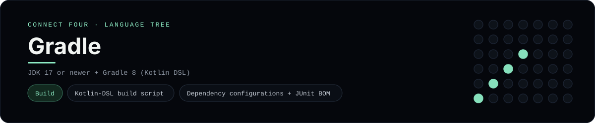

# Gradle Implementation

A small Java Connect Four project built, tested and run with Gradle and the
Kotlin DSL - a [framework showcase](../../README.md) alongside the console
implementations in [`languages/`](../../languages). Gradle is a build tool, so
this project is about the build script, the task graph and the test run rather
than the byte-for-byte stdin/stdout console protocol, and the dashboard shows one
representative file from it rather than a single source file.

## Prerequisites

* **Toolchain:** JDK 17 or newer + Gradle 8 or newer
* **Check it is installed:** `java -version` and `gradle --version`

| Platform | Install command |
| --- | --- |
| Windows | `winget install Microsoft.OpenJDK.21` then `scoop install gradle` |
| macOS | `brew install openjdk gradle` |
| Debian/Ubuntu | `apt-get install default-jdk gradle` |

## How to run

Everything the project needs is under `frameworks/gradle/`; run it from that
folder:

```sh
cd frameworks/gradle
gradle test        # compile + run the JUnit 5 suite
gradle run         # play the scripted game
gradle build       # assemble + check, dropping build/libs/connect-four-0.1.0.jar
gradle installDist # build/install/connect-four/bin/connect-four launcher
```

`gradle run` prints the finished board and the winner.

## How the project is built

* **Build script** - `build.gradle.kts` (the representative file) applies the
  `application` plugin, points at `mavenCentral()`, imports the JUnit BOM into
  the `testImplementation` configuration, pins the Java toolchain to 17, and sets
  the main class - plus `tasks.test { useJUnitPlatform() }` so JUnit 5 actually
  runs.
* **Settings** - `settings.gradle.kts` names the root project, which is what makes
  `gradle run` and `gradle test` resolve without arguments.
* **App** - `src/main/java/.../Board.java` is the 6x7 rules engine (`drop`,
  `isFull`, `winner`, `lowestEmptyRow`); `Main.java` plays a scripted game and
  prints the board.
* **Tests** - `src/test/java/.../BoardTest.java` is a JUnit 5 suite covering the
  empty start, a horizontal win, a vertical win and a rejected full column.

## Skills demonstrated

* The Kotlin DSL: plugins block, typed accessors (`java { }`, `application { }`)
* Dependency configurations and the `platform(...)` BOM import
* Java toolchains and the test task (`useJUnitPlatform()`)
* Task-graph commands (`test`, `run`, `build`, `installDist`)

## Where the full app lives

The dashboard shows the build script, `build.gradle.kts`, and links the whole
folder on GitHub. Everything the project needs is under `frameworks/gradle/`:

```
frameworks/gradle/
  build.gradle.kts
  settings.gradle.kts
  src/main/java/com/example/connectfour/Board.java
  src/main/java/com/example/connectfour/Main.java
  src/test/java/com/example/connectfour/BoardTest.java
```

The showcase dashboard shows this framework's representative file when you
open the **Frameworks** browse mode, addressable at `index.html?lang=gradle`.
