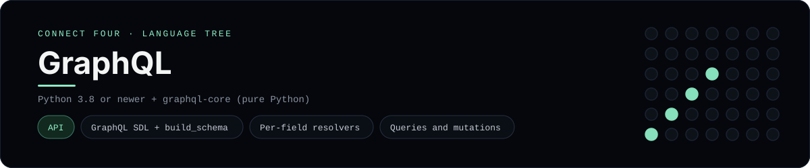

# GraphQL Implementation

A Connect Four **GraphQL API**: `schema.graphql` declares the `Board` type plus
the `Query` and `Mutation` operations, and `server.py` binds those fields to a
small Python resolver layer over the game rules. It is a
[framework showcase](../../README.md) rather than a console language, so the
dashboard shows one representative file from it (the schema) and links the whole
folder on GitHub.

## Prerequisites

* **Toolchain:** Python 3.8 or newer + the pure-Python `graphql-core`
* **Check it is installed:** `python -c "import graphql"`

| Platform | Install command |
| --- | --- |
| Windows | `pip install graphql-core` |
| macOS | `pip install graphql-core` |
| Debian/Ubuntu | `pip install graphql-core` |

## How to run

Install the one dependency, then run the built-in demo, which fires a query, a
mutation and a scripted game against the schema:

```sh
cd frameworks/graphql
pip install graphql-core
python server.py
```

To explore it yourself, import the schema and execute any operation from
`queries.graphql`:

```python
from server import run

run("{ board { rows columns cells } }")
run("mutation { drop(column: 4) { moves player } }")
```

## How the example is built

* **Schema** - `schema.graphql` is the contract: `Query { board, currentPlayer,
  columnHeights }`, `Mutation { drop, reset, replay }` and a `Board` type with
  `cells` as `[[String!]!]!`. It is plain SDL, so it is loaded with
  `build_schema` and no code generation step is involved.
* **Resolvers** - `server.py` binds each field with `wire()`. Queries read the
  current game and mutations drop, reset or replay a scripted game; `snapshot`
  turns a `Board` into the dict the default field resolver reads.
* **Operations** - `queries.graphql` collects ready-to-run operations, including a
  variable-driven `Drop` and a `Replay` that ends in `X`'s horizontal win.

## Skills demonstrated

* A GraphQL schema in SDL with queries, mutations and object types
* `build_schema` and per-field resolvers with `graphql-core`
* A context object carrying game state between operations

## Where the full project lives

The dashboard shows the schema, `schema.graphql`, and links the whole folder on
GitHub. Everything the example needs is under `frameworks/graphql/`:

```
frameworks/graphql/
  board.py
  queries.graphql
  schema.graphql
  server.py
```

The showcase dashboard shows this framework's representative file when you
open the **Frameworks** browse mode, addressable at `index.html?lang=graphql`.
