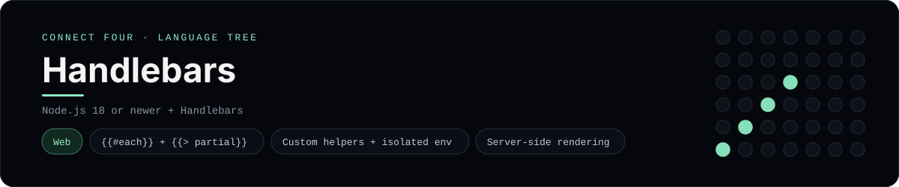

# Handlebars Implementation

A small Handlebars app that plays Connect Four in the browser - a
[framework showcase](../../README.md) alongside the console implementations in
[`languages/`](../../languages). Handlebars is a logic-less templating engine, so
this app renders HTML on the server instead of the byte-for-byte stdin/stdout
console protocol, and the dashboard shows one representative file from it rather
than a single source file.

## Prerequisites

* **Toolchain:** Node.js 18 or newer
* **Check it is installed:** `node --version`

| Platform | Install command |
| --- | --- |
| Windows | `winget install OpenJS.NodeJS` |
| macOS | `brew install node` |
| Debian/Ubuntu | `apt-get install nodejs` |

## How to run

Everything the app needs is under `frameworks/handlebars/`; run it from that
folder:

```sh
cd frameworks/handlebars
npm install
npm start
```

Then open <http://localhost:3000> and play - the board is a 6x7 grid whose
bottom row is the first to fill, and the first player to line up four `X`s or
`O`s wins.

## How the game is built

* **Template** - `templates/board.hbs` is the page: nested `{{#each}}` loops draw
  the grid, a `{{> cell}}` partial renders each slot, and two custom helpers
  (`cellClass`, `disabledAttr`) keep the markup logic-less.
* **Renderer** - `src/render.js` creates an isolated Handlebars environment with
  `Handlebars.create()`, registers the partial and helpers, and compiles the
  template once into a reusable render function.
* **Server** - `server.js` is a tiny `node:http` server: `GET /` renders the
  board, `POST /move` and `POST /reset` mutate a cookie-scoped in-memory game and
  redirect back (post/redirect/get). `src/board.js` holds the 6x7 rules, with
  both diagonals checked from every cell.

## Skills demonstrated

* Handlebars `{{#each}}`, block helpers and `{{> partial}}`
* Custom helpers and isolated environments (`Handlebars.create`)
* Server-side rendering with post/redirect/get
* An array-of-arrays board with diagonal win detection

## Where the full app lives

The dashboard shows the template, `templates/board.hbs`, and links the whole
folder on GitHub. Everything the app needs is under `frameworks/handlebars/`:

```
frameworks/handlebars/
  templates/board.hbs
  templates/partials/cell.hbs
  src/board.js
  src/render.js
  server.js
  package.json
```

The showcase dashboard shows this framework's representative file when you
open the **Frameworks** browse mode, addressable at
`index.html?lang=handlebars`.
