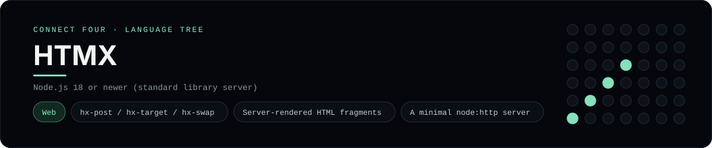

# HTMX Implementation

A small htmx app that plays Connect Four in the browser - a
[framework showcase](../../README.md) alongside the console implementations in
[`languages/`](../../languages). htmx drives the page with hypermedia attributes
instead of a client-side framework, so this app returns HTML fragments rather
than the byte-for-byte stdin/stdout console protocol, and the dashboard shows
one representative file from it rather than a single source file.

## Prerequisites

* **Toolchain:** Node.js 18 or newer (the server uses only the standard library)
* **Check it is installed:** `node --version`

| Platform | Install command |
| --- | --- |
| Windows | `winget install OpenJS.NodeJS` |
| macOS | `brew install node` |
| Debian/Ubuntu | `apt-get install nodejs` |

## How to run

Everything the app needs is under `frameworks/htmx/`; run it from that folder:

```sh
cd frameworks/htmx
node server.js
```

Then open <http://localhost:3000> and play - the board is a 6x7 grid whose
bottom row is the first to fill, and the first player to line up four `X`s or
`O`s wins. htmx is loaded from a CDN, so no install step is needed.

## How the game is built

* **Board** - `board.js` is plain CommonJS with the 6x7 rules: `drop`,
  `isColumnFull`, `winner` and `lowestEmptyRow`. Both diagonals are checked
  from every cell, matching the win detection the console implementations use.
* **Server** - `server.js` is a tiny `node:http` server. It renders the whole
  page once, then answers `POST /move` and `POST /reset` with just the `#game`
  fragment that `hx-target` swaps in (`hx-swap="outerHTML"`), so the browser
  never re-renders the layout.
* **Session** - a cookie id keys an in-memory `Map`, so each visitor keeps their
  own game the way the other frameworks keep it in a session.

## Skills demonstrated

* htmx attributes (`hx-post`, `hx-target`, `hx-swap`) and hypermedia swapping
* Server-rendered HTML fragments with no JSON round-trip
* A minimal `node:http` server and cookie-scoped state
* An array-of-arrays board with diagonal win detection

## Where the full app lives

The dashboard shows the server, `server.js`, and links the whole folder on
GitHub. Everything the app needs is under `frameworks/htmx/`:

```
frameworks/htmx/
  board.js
  server.js
  package.json
```

The showcase dashboard shows this framework's representative file when you
open the **Frameworks** browse mode, addressable at `index.html?lang=htmx`.
