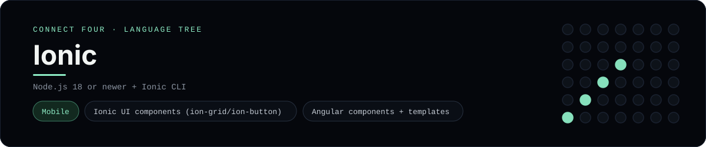

# Ionic Implementation

A small Ionic app that plays Connect Four on mobile and the web - a
[framework showcase](../../README.md) alongside the console implementations in
[`languages/`](../../languages). Ionic builds cross-platform apps from web
components, so this app renders the Ionic UI kit instead of the byte-for-byte
stdin/stdout console protocol, and the dashboard shows one representative file
from it rather than a single source file.

## Prerequisites

* **Toolchain:** Node.js 18 or newer + the Ionic CLI
* **Check it is installed:** `node --version` and `ionic --version`

| Platform | Install command |
| --- | --- |
| Windows | `winget install OpenJS.NodeJS` then `npm install -g @ionic/cli` |
| macOS | `brew install node` then `npm install -g @ionic/cli` |
| Debian/Ubuntu | `apt-get install nodejs` then `npm install -g @ionic/cli` |

## How to run

Everything the app needs is under `frameworks/ionic/`; run it from that folder:

```sh
cd frameworks/ionic
npm install
ionic serve
```

Then open the printed <http://localhost:8100> and play - the board is a 6x7
grid whose bottom row is the first to fill, and the first player to line up
four `X`s or `O`s wins. The same page runs on a device via Capacitor.

## How the game is built

* **Board** - `src/app/connect-four/board.ts` is a `ConnectFourBoard` class with
  the 6x7 rules: `play`, `isFull`, `winner` and `lowestEmptyRow`. Both diagonals
  are checked from every cell, matching the win detection the console
  implementations use.
* **Page** - `src/app/connect-four/connect-four.page.ts` is the Angular
  component; its template uses Ionic components (`ion-header`, `ion-grid`,
  `ion-button`) and Angular directives to render the board.

## Skills demonstrated

* Ionic UI components with Angular (`ion-grid`, `ion-button`, `ion-content`)
* Angular components, templates and `*ngFor`/`*ngIf`
* Cross-platform (single codebase for iOS, Android and web)
* A class-based board with diagonal win detection

## Where the full app lives

The dashboard shows the page component, `connect-four.page.ts`, and links the
whole folder on GitHub. Everything the app needs is under
`frameworks/ionic/`:

```
frameworks/ionic/
  src/app/connect-four/board.ts
  src/app/connect-four/connect-four.page.ts
  src/app/connect-four/connect-four.page.html
  src/app/connect-four/connect-four.module.ts
  package.json
```

The showcase dashboard shows this framework's representative file when you
open the **Frameworks** browse mode, addressable at `index.html?lang=ionic`.
