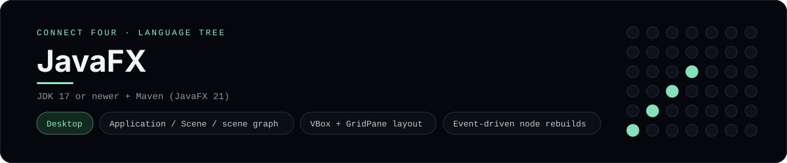

# JavaFX Implementation

A small JavaFX app that plays Connect Four as a desktop window - a
[framework showcase](../../README.md) alongside the console implementations in
[`languages/`](../../languages). JavaFX is the JVM desktop UI toolkit, so this
app draws a scene graph instead of the byte-for-byte stdin/stdout console
protocol, and the dashboard shows one representative file from it rather than a
single source file.

## Prerequisites

* **Toolchain:** JDK 17 or newer + Maven
* **Check it is installed:** `java -version` and `mvn --version`

| Platform | Install command |
| --- | --- |
| Windows | `winget install Microsoft.OpenJDK.21` |
| macOS | `brew install openjdk` |
| Debian/Ubuntu | `apt-get install default-jdk` |

## How to run

Everything the app needs is under `frameworks/javafx/`; run it from that folder
(the JavaFX Maven plugin downloads the toolkit for your platform):

```sh
cd frameworks/javafx
mvn javafx:run
```

A desktop window opens - the board is a 6x7 grid whose bottom row is the first
to fill, and the first player to line up four `X`s or `O`s wins.

## How the game is built

* **Board** - `src/main/java/.../Board.java` holds the 6x7 rules: `drop`,
  `isFull`, `winner` and `lowestEmptyRow`. Both diagonals are checked from every
  cell, matching the win detection the console implementations use.
* **App** - `src/main/java/.../ConnectFourApp.java` is the JavaFX `Application`:
  it builds a `GridPane` of `Circle` discs and a row of `Button`s in a `VBox`,
  and rebuilds them on every event.

## Skills demonstrated

* JavaFX `Application`, `Scene` and scene-graph layout (`VBox`, `GridPane`)
* Event handlers and rebuilding nodes on state change
* Shape and colour styling (`Circle`, `Paint`)
* A 2-D array board with diagonal win detection

## Where the full app lives

The dashboard shows the app, `src/main/java/com/example/connectfour/ConnectFourApp.java`,
and links the whole folder on GitHub. Everything the app needs is under
`frameworks/javafx/`:

```
frameworks/javafx/
  src/main/java/com/example/connectfour/Board.java
  src/main/java/com/example/connectfour/ConnectFourApp.java
  pom.xml
```

The showcase dashboard shows this framework's representative file when you
open the **Frameworks** browse mode, addressable at `index.html?lang=javafx`.
