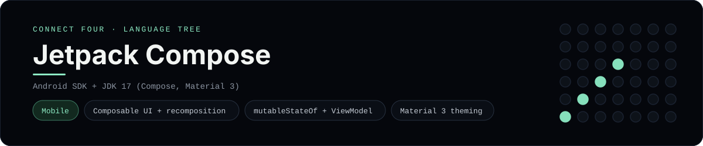

# Jetpack Compose Implementation

A small Jetpack Compose app that plays Connect Four on Android - a
[framework showcase](../../README.md) alongside the console implementations in
[`languages/`](../../languages). Jetpack Compose is Android's declarative UI
toolkit, so this app draws native widgets instead of the byte-for-byte
stdin/stdout console protocol, and the dashboard shows one representative file
from it rather than a single source file.

## Prerequisites

* **Toolchain:** Android Studio (or the Android SDK + JDK 17) with the Compose
  libraries
* **Check it is installed:** `java -version` and `adb --version`

| Platform | Install command |
| --- | --- |
| Windows | `winget install Google.AndroidStudio` |
| macOS | `brew install --cask android-studio` |
| Debian/Ubuntu | install Android Studio from Google |

## How to run

Everything the app needs is under `frameworks/jetpackcompose/`; open that
folder as an Android project in Android Studio, or build it from the command
line:

```sh
cd frameworks/jetpackcompose
gradle installDebug
```

Then play on a device or emulator - the board is a 6x7 grid whose bottom row is
the first to fill, and the first player to line up four discs wins.

## How the game is built

* **Board** - `app/src/main/java/.../Board.kt` is an immutable
  `ConnectFourBoard` data class with the 6x7 rules: `drop`, `isFull`, `winner`
  and `lowestEmptyRow`. Every move returns a fresh board and both diagonals are
  checked from every cell, matching the win detection the console
  implementations use.
* **ViewModel** - `GameViewModel.kt` holds the board in `mutableStateOf` so
  Compose recomposes on every move.
* **Screen** - `MainActivity.kt` is the `@Composable` screen: a header, a
  status line, the disc grid and a row of column buttons, all styled with
  Material 3.

## Skills demonstrated

* Composable UI with `Column`, `Row` and `Box`
* State hoisting with `mutableStateOf` and a `ViewModel`
* Material 3 theming and declarative recomposition
* An immutable board with diagonal win detection

## Where the full app lives

The dashboard shows the screen, `MainActivity.kt`, and links the whole folder
on GitHub. Everything the app needs is under `frameworks/jetpackcompose/`:

```
frameworks/jetpackcompose/
  app/src/main/java/com/example/connectfour/Board.kt
  app/src/main/java/com/example/connectfour/GameViewModel.kt
  app/src/main/java/com/example/connectfour/MainActivity.kt
  app/build.gradle.kts
```

The showcase dashboard shows this framework's representative file when you
open the **Frameworks** browse mode, addressable at
`index.html?lang=jetpackcompose`.
