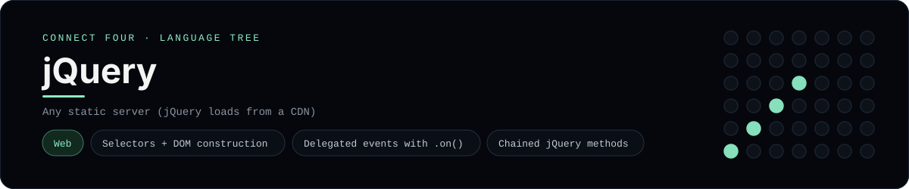

# jQuery Implementation

A small jQuery page that plays Connect Four in the browser - a
[framework showcase](../../README.md) alongside the console implementations in
[`languages/`](../../languages). jQuery manipulates the DOM directly, so this
app builds the board from elements instead of the byte-for-byte stdin/stdout
console protocol, and the dashboard shows one representative file from it
rather than a single source file.

## Prerequisites

* **Toolchain:** Any static file server (jQuery loads from a CDN)
* **Check it is installed:** `node --version` (for `npx serve`)

| Platform | Install command |
| --- | --- |
| Windows | `winget install OpenJS.NodeJS` |
| macOS | `brew install node` |
| Debian/Ubuntu | `apt-get install nodejs` |

## How to run

Everything the app needs is under `frameworks/jquery/`; run it from that folder:

```sh
cd frameworks/jquery
npx serve .
```

Then open the printed URL and play - the board is a 6x7 grid whose bottom row is
the first to fill, and the first player to line up four `X`s or `O`s wins.
jQuery comes from a CDN, so there is no build step.

## How the game is built

* **App** - `app.js` holds the flat 6x7 board and the rules (`drop`,
  `isColumnFull`, `winner`, `lowestEmptyRow`); both diagonals are checked from
  every cell, matching the console implementations.
* **jQuery** - the grid is rebuilt with `$("<tr>")`/`$("<td>")` and `.appendTo`,
  and moves are handled by a single delegated handler
  (`$("#columns").on("click", "button", ...)`) that reads the column from
  `$(this).index()`.
* **Markup** - `index.html` is the static shell; `styles.css` draws the blue
  board and the red/yellow discs.

## Skills demonstrated

* jQuery selectors, traversal and element construction
* `$(document).ready` shorthand and event delegation with `.on()`
* DOM building with chained `.addClass`/`.text`/`.prop`
* An array-of-arrays board with diagonal win detection

## Where the full app lives

The dashboard shows the script, `app.js`, and links the whole folder on GitHub.
Everything the app needs is under `frameworks/jquery/`:

```
frameworks/jquery/
  app.js
  index.html
  styles.css
  package.json
```

The showcase dashboard shows this framework's representative file when you
open the **Frameworks** browse mode, addressable at `index.html?lang=jquery`.
