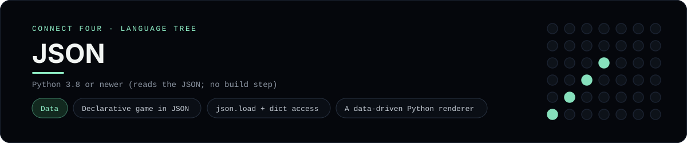

# JSON Implementation

A data-first Connect Four: the whole game - the board size, the players and a
scripted run of moves - is described in `connect_four.json`, and a small Python
loader (`play.py`) reads that file and plays it out. It is a
[framework showcase](../../README.md) rather than a console language, so the
dashboard shows one representative file from it (the JSON itself) and links the
whole folder on GitHub.

## Prerequisites

* **Toolchain:** Python 3.8 or newer (it only reads the JSON - no build step)
* **Check it is installed:** `python --version`

| Platform | Install command |
| --- | --- |
| Windows | `winget install Python.Python.3.12` |
| macOS | `brew install python` |
| Debian/Ubuntu | `apt-get install python3` |

## How to run

Nothing to build. From `frameworks/json/`, run the loader against the JSON next
to it:

```sh
cd frameworks/json
python play.py
```

Pass a different file to play any game with the same shape:

```sh
python play.py my_game.json
```

The loader prints the empty board, then the board after every move, and finally
names the winner. The bundled `connect_four.json` is a short scripted game that
ends in a horizontal win for `X`.

## How the example is built

* **Data** - `connect_four.json` declares the board (`rows`, `columns`,
  `empty`), the `players`, and the `moves` to replay. The rules themselves are
  not in the JSON, so the same loader plays any file with that shape.
* **Loader** - `play.py` is the interpreter: `load_game` reads the file with
  `json.load`, `render` draws the board from the dimensions it finds, and
  `has_line` checks all four directions for a win. Nothing is hard-coded to 6x7.

## Skills demonstrated

* A declarative game definition in JSON
* `json.load` and dictionary access in Python
* A renderer and win detection driven entirely by data

## Where the full project lives

The dashboard shows the data file, `connect_four.json`, and links the whole
folder on GitHub. Everything the example needs is under `frameworks/json/`:

```
frameworks/json/
  connect_four.json
  play.py
```

The showcase dashboard shows this framework's representative file when you
open the **Frameworks** browse mode, addressable at `index.html?lang=json`.
