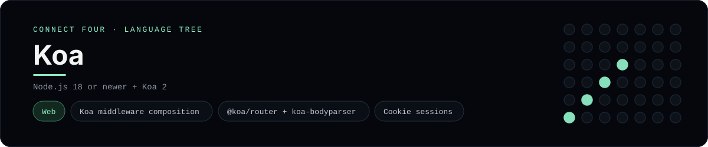

# Koa Implementation

A small Koa app that plays Connect Four in the browser - a
[framework showcase](../../README.md) alongside the console implementations in
[`languages/`](../../languages). Koa is a minimal Node.js web framework, so this
app serves HTML instead of the byte-for-byte stdin/stdout console protocol, and
the dashboard shows one representative file from it rather than a single source
file.

## Prerequisites

* **Toolchain:** Node.js 18 or newer
* **Check it is installed:** `node --version`

| Platform | Install command |
| --- | --- |
| Windows | `winget install OpenJS.NodeJS` |
| macOS | `brew install node` |
| Debian/Ubuntu | `apt-get install nodejs` |

## How to run

Everything the app needs is under `frameworks/koa/`; run it from that folder:

```sh
cd frameworks/koa
npm install
npm start
```

Then open <http://localhost:3000> and play - the board is a 6x7 grid whose
bottom row is the first to fill, and the first player to line up four `X`s or
`O`s wins.

## How the game is built

* **Board** - `lib/board.js` is plain ES-module JavaScript with the 6x7 rules:
  `drop`, `isColumnFull`, `winner` and `lowestEmptyRow`. Both diagonals are
  checked from every cell, matching the win detection the console
  implementations use.
* **App** - `app.js` composes the middleware stack (`koa-session`,
  `koa-bodyparser` and `@koa/router`), then serves `GET /`, `POST /move` and
  `POST /reset`. The board lives in the cookie session and every mutation
  redirects back (post/redirect/get).

## Skills demonstrated

* Koa middleware composition and `ctx` handling
* Router, body parsing and cookie sessions
* Server-rendered HTML without a template engine
* An array-of-arrays board with diagonal win detection

## Where the full app lives

The dashboard shows the app, `app.js`, and links the whole folder on GitHub.
Everything the app needs is under `frameworks/koa/`:

```
frameworks/koa/
  lib/board.js
  app.js
  package.json
```

The showcase dashboard shows this framework's representative file when you
open the **Frameworks** browse mode, addressable at `index.html?lang=koa`.
