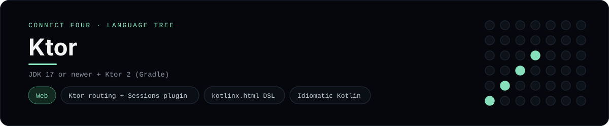

# Ktor Implementation

A small Ktor app that plays Connect Four in the browser - a
[framework showcase](../../README.md) alongside the console implementations in
[`languages/`](../../languages). Ktor is JetBrains' Kotlin web framework, so
this app serves HTML instead of the byte-for-byte stdin/stdout console protocol,
and the dashboard shows one representative file from it rather than a single
source file.

## Prerequisites

* **Toolchain:** JDK 17 or newer + Gradle (the wrapper is included by Ktor)
* **Check it is installed:** `java -version` and `gradle --version`

| Platform | Install command |
| --- | --- |
| Windows | `winget install Microsoft.OpenJDK.21` |
| macOS | `brew install openjdk` |
| Debian/Ubuntu | `apt-get install default-jdk` |

## How to run

Everything the app needs is under `frameworks/ktor/`; run it from that folder:

```sh
cd frameworks/ktor
gradle run
```

Then open <http://localhost:8080> and play - the board is a 6x7 grid whose
bottom row is the first to fill, and the first player to line up four `X`s or
`O`s wins.

## How the game is built

* **Board** - `src/main/kotlin/.../Board.kt` holds the 6x7 rules: `drop`,
  `isFull`, `winner` and `lowestEmptyRow`. Both diagonals are checked from every
  cell, matching the win detection the console implementations use. The board
  encodes itself to a string so it can live in the session.
* **App** - `src/main/kotlin/.../Application.kt` installs the `Sessions` plugin,
  then routes `GET /`, `POST /move` and `POST /reset`. The page is rendered with
  Ktor's `kotlinx.html` DSL and every mutation redirects back
  (post/redirect/get).

## Skills demonstrated

* Ktor routing, sessions and the `kotlinx.html` DSL
* Idiomatic Kotlin (`firstOrNull`, ranges, destructuring)
* String-encoded session state
* A list-of-lists board with diagonal win detection

## Where the full app lives

The dashboard shows the application entry point, `Application.kt`, and links
the whole folder on GitHub. Everything the app needs is under
`frameworks/ktor/`:

```
frameworks/ktor/
  src/main/kotlin/com/example/connectfour/Board.kt
  src/main/kotlin/com/example/connectfour/Application.kt
  build.gradle.kts
  settings.gradle.kts
```

The showcase dashboard shows this framework's representative file when you
open the **Frameworks** browse mode, addressable at `index.html?lang=ktor`.
