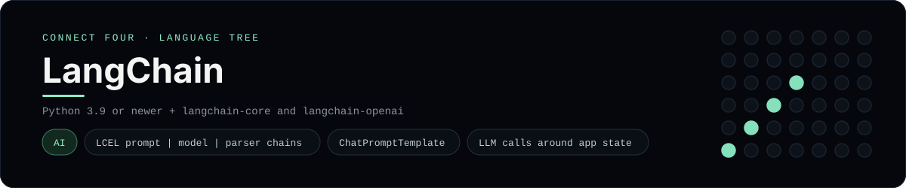

# LangChain Implementation

A small Flask app that plays Connect Four with a LangChain coach - a
[framework showcase](../../README.md) alongside the console implementations in
[`languages/`](../../languages). LangChain composes LLM calls into chains, so
this app asks a model for advice instead of using the byte-for-byte
stdin/stdout console protocol, and the dashboard shows one representative file
from it rather than a single source file.

## Prerequisites

* **Toolchain:** Python 3.9 or newer with langchain-core, langchain-openai and
  Flask, plus an OpenAI API key
* **Check it is installed:** `python --version` and `python -c "import langchain_core"`

| Platform | Install command |
| --- | --- |
| Windows | `pip install langchain-core langchain-openai Flask` |
| macOS | `pip install langchain-core langchain-openai Flask` |
| Debian/Ubuntu | `pip install langchain-core langchain-openai Flask` |

## How to run

Everything the app needs is under `frameworks/langchain/`; run it from that
folder:

```sh
cd frameworks/langchain
pip install -r requirements.txt
set OPENAI_API_KEY=sk-...        # Windows; use export on macOS/Linux
python app.py
```

Then open <http://localhost:5000>: play moves with the column buttons and press
**Ask the coach** to have the model suggest a column. The board is a 6x7 grid
whose bottom row is the first to fill, and the first player to line up four
`X`s or `O`s wins.

## How the game is built

* **Board** - `board.py` holds the 6x7 rules (`drop`, `is_full`, `winner`,
  `lowest_empty_row`) plus a `render()` that prints the grid for the prompt.
* **Coach** - `coach.py` builds a `ChatPromptTemplate | ChatOpenAI | StrOutputParser`
  chain with LCEL; `suggest_move(board)` feeds the current player and rendered
  board into it.
* **App** - `app.py` is a Flask app whose `/coach` route returns the chain's
  advice as JSON.

## Skills demonstrated

* LangChain LCEL (`prompt | model | parser`) and `ChatPromptTemplate`
* Wiring an LLM call around real application state
* Environment-based model configuration
* A list-of-lists board with diagonal win detection

## Where the full app lives

The dashboard shows the chain, `coach.py`, and links the whole folder on GitHub.
Everything the app needs is under `frameworks/langchain/`:

```
frameworks/langchain/
  board.py
  coach.py
  app.py
  templates/board.html
  requirements.txt
```

The showcase dashboard shows this framework's representative file when you
open the **Frameworks** browse mode, addressable at `index.html?lang=langchain`.
