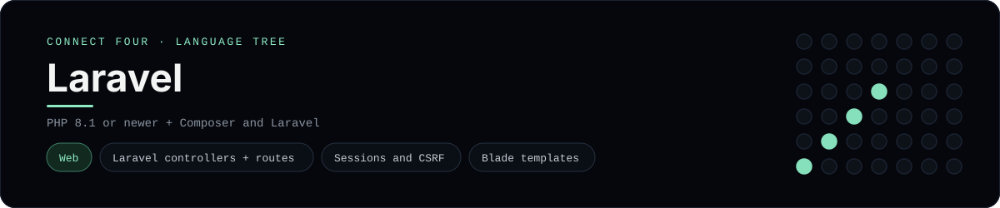

# Laravel Implementation

A small Laravel app that plays Connect Four in the browser - a
[framework showcase](../../README.md) alongside the console implementations in
[`languages/`](../../languages). Laravel is a web framework, so this app serves
HTML instead of the byte-for-byte stdin/stdout console protocol, and the
dashboard shows one representative file from it rather than a single source
file.

## Prerequisites

* **Toolchain:** PHP 8.1 or newer, Composer, and the Laravel installer
* **Check it is installed:** `php -v` and `composer --version`

| Platform | Install command |
| --- | --- |
| Windows | `composer global require laravel/installer` |
| macOS | `composer global require laravel/installer` |
| Debian/Ubuntu | `composer global require laravel/installer` |

## How to run

Generate a Laravel project and drop these files into it (the app is a slice, so
the scaffolding comes from the installer):

```sh
laravel new connectfour
cp -r frameworks/laravel/app/. connectfour/app/
cp -r frameworks/laravel/routes/. connectfour/routes/
cp -r frameworks/laravel/resources/. connectfour/resources/
cd connectfour && php artisan serve
```

Then open <http://127.0.0.1:8000> and play - the board is a 6x7 grid whose
bottom row is the first to fill, and the first player to line up four `X`s or
`O`s wins.

## How the game is built

* **Board** - `app/Support/ConnectFourBoard.php` holds the 6x7 board and the
  rules: `drop`, `isFull`, `winner`, `isOver` and `hasLine`. It serialises to
  and from plain arrays so it can live in the session, and both diagonals are
  checked from every cell, matching the win detection the console
  implementations use.
* **Controller** - `app/Http/Controllers/GameController.php` reads the game from
  the session, validates the chosen column, applies the move and redirects back
  (post/redirect/get), so a refresh never re-plays a move.
* **Routes** - `routes/web.php` names the board, `move` and `reset` routes on
  the `GameController`.
* **View** - `resources/views/game/board.blade.php` is a Blade template that
  renders the board and a row of column buttons; the status line announces
  whose turn it is or who won, and `@csrf` / `@method('DELETE')` protect the
  forms.

## Skills demonstrated

* Laravel controllers, named routes and route-model-free actions
* Sessions, `redirect()->route()` and post/redirect/get
* Blade templates with `@csrf` and `@method`
* An array-of-arrays board with diagonal win detection

## Where the full app lives

The dashboard shows the controller, `app/Http/Controllers/GameController.php`,
and links the whole folder on GitHub. Everything the app needs is under
`frameworks/laravel/`:

```
frameworks/laravel/
  app/Support/ConnectFourBoard.php
  app/Http/Controllers/GameController.php
  routes/web.php
  resources/views/game/board.blade.php
```

The showcase dashboard shows this framework's representative file when you
open the **Frameworks** browse mode, addressable at `index.html?lang=laravel`.
