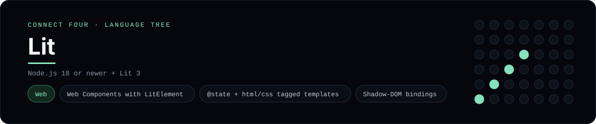

# Lit Implementation

A small Lit app that plays Connect Four in the browser - a
[framework showcase](../../README.md) alongside the console implementations in
[`languages/`](../../languages). Lit is a tiny library for Web Components, so
this app ships a custom element instead of the byte-for-byte stdin/stdout
console protocol, and the dashboard shows one representative file from it rather
than a single source file.

## Prerequisites

* **Toolchain:** Node.js 18 or newer
* **Check it is installed:** `node --version`

| Platform | Install command |
| --- | --- |
| Windows | `winget install OpenJS.NodeJS` |
| macOS | `brew install node` |
| Debian/Ubuntu | `apt-get install nodejs` |

## How to run

Everything the app needs is under `frameworks/lit/`; run it from that folder:

```sh
cd frameworks/lit
npm install
npm run dev
```

Then open the printed <http://localhost:5173> and play - the board is a 6x7 grid
whose bottom row is the first to fill, and the first player to line up four
`X`s or `O`s wins.

## How the game is built

* **Element** - `src/connect-four.ts` is a `LitElement` registered with
  `@customElement("connect-four")`. The board and move count are `@state`
  fields, the header is a `render()` that returns an `html` tagged template, and
  events are wired with `@click` bindings.
* **Board** - `src/board.ts` is plain TypeScript with the 6x7 rules (`drop`,
  `isColumnFull`, `winner`, `lowestEmptyRow`); both diagonals are checked from
  every cell, matching the console implementations.
* **Styles** - the element carries its own encapsulated styles in a
  `static styles = css\`...\`` shadow-DOM stylesheet, so the page needs no CSS.

## Skills demonstrated

* Web Components with Lit (`LitElement`, `@customElement`)
* `@state` reactivity and the `html`/`css` tagged-template tags
* Property/attribute bindings (`?disabled=`, `@click=`) in shadow DOM
* A typed array-of-arrays board with diagonal win detection

## Where the full app lives

The dashboard shows the element, `src/connect-four.ts`, and links the whole
folder on GitHub. Everything the app needs is under `frameworks/lit/`:

```
frameworks/lit/
  src/board.ts
  src/connect-four.ts
  index.html
  package.json
  tsconfig.json
```

The showcase dashboard shows this framework's representative file when you
open the **Frameworks** browse mode, addressable at `index.html?lang=lit`.
