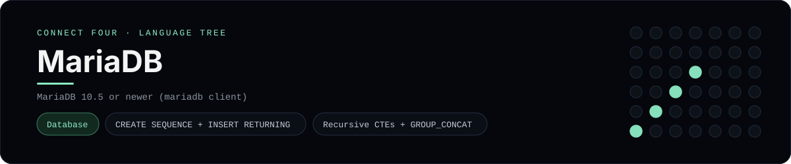

# MariaDB Implementation

A pure-MariaDB schema and query set for Connect Four - a
[framework showcase](../../README.md) alongside the console implementations in
[`languages/`](../../languages). MariaDB is a relational database, so it answers
with result sets instead of the byte-for-byte stdin/stdout console protocol, and
the dashboard shows one representative file from it rather than a single source
file.

## Prerequisites

* **Toolchain:** MariaDB 10.5 or newer (the `mysql`/`mariadb` client)
* **Check it is installed:** `mariadb --version`

| Platform | Install command |
| --- | --- |
| Windows | `winget install MariaDB.Server` |
| macOS | `brew install mariadb` |
| Debian/Ubuntu | `apt-get install mariadb-server` |

## How to run

Everything the app needs is under `frameworks/mariadb/`; run it from that folder:

```sh
cd frameworks/mariadb
mariadb connect_four < schema.sql
mariadb connect_four < seed.sql
mariadb connect_four < queries.sql
```

The seed plays a horizontal win for `X` in the bottom row, so `queries.sql`
prints the rendered board.

## How the game is built

* **Schema** - `schema.sql` uses a `SEQUENCE` as the `games` key default and an
  `AUTO_INCREMENT` key on `moves`, with foreign/unique/CHECK constraints, an
  index and a `cells` view that numbers discs with `ROW_NUMBER() OVER (...)`.
* **Seed** - `seed.sql` inserts the game with MariaDB's `INSERT ... RETURNING`.
* **Queries** - `queries.sql` renders the grid with a **recursive CTE** and
  `GROUP_CONCAT(... ORDER BY ... SEPARATOR ' ')`, then finds the winning line
  with window `COUNT(*) OVER (...)` runs over four keys (row, column and both
  diagonals).

## Skills demonstrated

* `CREATE SEQUENCE` defaults and `INSERT ... RETURNING`
* Recursive CTEs, `GROUP_CONCAT` with ordering, and joins
* Window-function run detection across rows, columns and diagonals
* Constraints and index design

## Where the full app lives

The dashboard shows the schema, `schema.sql`, and links the whole folder on
GitHub. Everything the app needs is under `frameworks/mariadb/`:

```
frameworks/mariadb/
  schema.sql
  seed.sql
  queries.sql
```

The showcase dashboard shows this framework's representative file when you
open the **Frameworks** browse mode, addressable at `index.html?lang=mariadb`.
