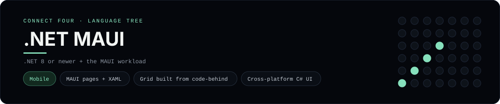

# .NET MAUI Implementation

A small .NET MAUI app that plays Connect Four on a phone or desktop - a
[framework showcase](../../README.md) alongside the console implementations in
[`languages/`](../../languages). .NET MAUI is a cross-platform UI framework, so
this app renders native controls from XAML and C# instead of the byte-for-byte
stdin/stdout console protocol, and the dashboard shows one representative file
from it rather than a single source file.

## Prerequisites

* **Toolchain:** the .NET SDK 8 or newer with the MAUI workload
* **Check it is installed:** `dotnet --version` and `dotnet workload list`

| Platform | Install command |
| --- | --- |
| Windows | `winget install Microsoft.DotNet.SDK.8` then `dotnet workload install maui` |
| macOS | `brew install dotnet-sdk` then `dotnet workload install maui` |
| Debian/Ubuntu | `apt-get install dotnet-sdk-8.0` then `dotnet workload install maui` |

## How to run

Generate a MAUI project and drop the app files into it (the app is a slice, so
the scaffolding comes from the template):

```sh
dotnet new maui -n ConnectFour
cp frameworks/maui/ConnectFourBoard.cs ConnectFour/
cp frameworks/maui/MainPage.xaml ConnectFour/
cp frameworks/maui/MainPage.xaml.cs ConnectFour/
cd ConnectFour && dotnet build -t:Run -f net8.0-android
```

Then pick a target - an Android emulator, an iOS simulator, Windows or macOS -
the board is a 6x7 grid whose bottom row is the first to fill, and the first
player to line up four `X`s or `O`s wins.

## How the game is built

* **Board** - `ConnectFourBoard.cs` holds the 6x7 board and the rules: `Drop`,
  `IsFull`, `Winner`, `IsOver` and `HasLine`. Both diagonals are checked from
  every cell, matching the win detection the console implementations use.
* **View** - `MainPage.xaml` declares the status label, the `Grid` that holds
  the 6x7 cells and a row of `Button`s, with `Clicked` handlers wired up.
* **Code-behind** - `MainPage.xaml.cs` is the page logic: it holds the board
  state, applies a move on a button press, and rebuilds the `Grid` children and
  the status label on every change.

## Skills demonstrated

* .NET MAUI pages, XAML views and code-behind
* Building a `Grid` and its children from C#
* Event handlers and cross-platform native controls
* A 2D array board with diagonal win detection

## Where the full app lives

The dashboard shows the code-behind, `MainPage.xaml.cs`, and links the whole
folder on GitHub. (The panel highlights the code-behind rather than the `.xaml`
file because Prism, the dashboard's highlighter, ships no XAML grammar - the
view is still in the folder on GitHub.) Everything the app adds is under
`frameworks/maui/`:

```
frameworks/maui/
  ConnectFourBoard.cs
  MainPage.xaml
  MainPage.xaml.cs
```

The showcase dashboard shows this framework's representative file when you
open the **Frameworks** browse mode, addressable at `index.html?lang=maui`.
