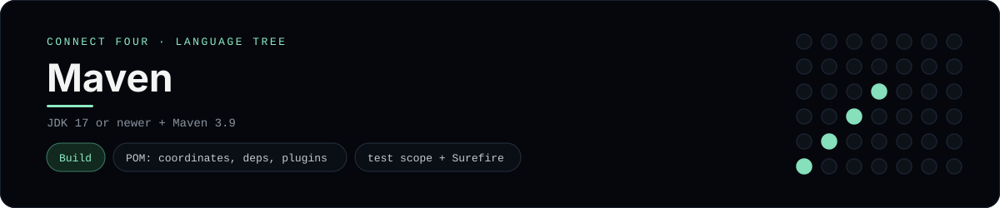

# Maven Implementation

A small Java Connect Four project built, tested and packaged with Apache Maven -
a [framework showcase](../../README.md) alongside the console implementations in
[`languages/`](../../languages). Maven is a build tool, so this project is about
the POM, the lifecycle and the test run rather than the byte-for-byte
stdin/stdout console protocol, and the dashboard shows one representative file
from it rather than a single source file.

## Prerequisites

* **Toolchain:** JDK 17 or newer + Maven 3.9 or newer
* **Check it is installed:** `java -version` and `mvn --version`

| Platform | Install command |
| --- | --- |
| Windows | `winget install Microsoft.OpenJDK.21` then `scoop install maven` |
| macOS | `brew install openjdk maven` |
| Debian/Ubuntu | `apt-get install default-jdk maven` |

## How to run

Everything the project needs is under `frameworks/maven/`; run it from that
folder:

```sh
cd frameworks/maven
mvn test          # compile + run the JUnit 5 suite
mvn package       # build target/connect-four.jar (runnable)
mvn exec:java     # play the scripted game
java -jar target/connect-four.jar
```

`mvn exec:java` prints the finished board and the winner.

## How the project is built

* **POM** - `pom.xml` (the representative file) declares the coordinates,
  `maven.compiler.release=17`, one `test`-scoped JUnit 5 dependency, and the four
  plugins that matter: `compiler`, `surefire`, `exec` and `jar` (with
  `Main-Class` in the manifest so the jar is runnable).
* **App** - `src/main/java/.../Board.java` is the 6x7 rules engine (`drop`,
  `isFull`, `winner`, `lowestEmptyRow`); `Main.java` plays a scripted game and
  prints the board.
* **Tests** - `src/test/java/.../BoardTest.java` is a JUnit 5 suite covering the
  empty start, a horizontal win, a vertical win and a rejected full column -
  `mvn test` runs it through Surefire.

## Skills demonstrated

* POM structure: coordinates, properties, dependencies and the `<scope>test</scope>`
* Plugin configuration (compiler, surefire, exec, jar + manifest)
* The Maven lifecycle: `compile` → `test` → `package`
* JUnit 5 assertions for win/tie detection and the full-column guard

## Where the full app lives

The dashboard shows the build file, `pom.xml`, and links the whole folder on
GitHub. Everything the project needs is under `frameworks/maven/`:

```
frameworks/maven/
  pom.xml
  src/main/java/com/example/connectfour/Board.java
  src/main/java/com/example/connectfour/Main.java
  src/test/java/com/example/connectfour/BoardTest.java
```

The showcase dashboard shows this framework's representative file when you
open the **Frameworks** browse mode, addressable at `index.html?lang=maven`.
