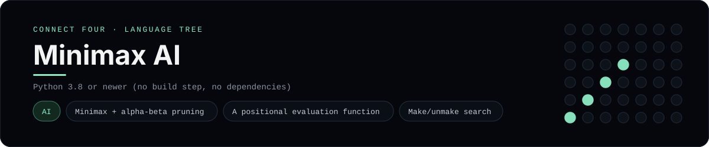

# Minimax AI Implementation

A Connect Four opponent, not a view layer: `minimax.py` searches the game tree
with **minimax and alpha-beta pruning**, `board.py` holds the rules, and
`play.py` drops two copies of the AI into a game against each other. It is a
[framework showcase](../../README.md) rather than a console language, so the
dashboard shows one representative file from it (the search) and links the whole
folder on GitHub.

## Prerequisites

* **Toolchain:** Python 3.8 or newer (no build step, no dependencies)
* **Check it is installed:** `python --version`

| Platform | Install command |
| --- | --- |
| Windows | `winget install Python.Python.3.12` |
| macOS | `brew install python` |
| Debian/Ubuntu | `apt-get install python3` |

## How to run

From `frameworks/minimax/`, play the AI against itself:

```sh
cd frameworks/minimax
python play.py
```

Pass a search depth (default 6) to trade strength for speed:

```sh
python play.py 4
```

To play against it yourself, import the two pieces and drive your own loop:

```python
from board import Board
from minimax import choose_move

board = Board()
column = choose_move(board, board.current_player)   # the AI's reply
```

## How the example is built

* **Search** - `minimax.py` explores the tree to a fixed depth with alpha-beta
  pruning. Open columns are tried centre-first, which finds strong moves sooner
  and prunes the rest; wins and losses score near `+/-(WIN + depth)` so the AI
  takes the quickest win and the slowest loss.
* **Evaluation** - the leaf score sums all 69 windows of four, weighting a
  window by how many of a player's discs it holds and skipping any window that
  already contains both players.
* **Board** - `board.py` is the 6x7 position with `drop`/`undo` (so the search
  makes and unmakes moves in place), plus `won_from`, which only inspects the
  line through the disc just played.
* **Driver** - `play.py` runs AI versus AI and prints the board after every move.

## Skills demonstrated

* Minimax game-tree search with alpha-beta pruning
* Make/unmake moves instead of copying the board
* A window-based positional evaluation function

## Where the full project lives

The dashboard shows the search, `minimax.py`, and links the whole folder on
GitHub. Everything the example needs is under `frameworks/minimax/`:

```
frameworks/minimax/
  board.py
  minimax.py
  play.py
```

The showcase dashboard shows this framework's representative file when you
open the **Frameworks** browse mode, addressable at `index.html?lang=minimax`.
