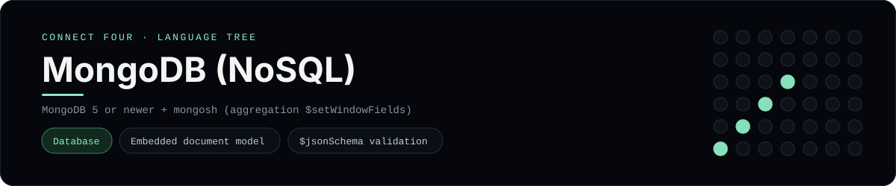

# MongoDB (NoSQL) Implementation

A Connect Four that lives in a document store: `schema.js` defines a `games`
collection whose moves are **embedded** in the game document, validated with a
`$jsonSchema`, `seed.js` loads a scripted game, and `queries.js` rebuilds the
board and finds four-in-a-row with aggregation pipelines. It is a
[framework showcase](../../README.md) rather than a console language, so the
dashboard shows one representative file from it (the schema) and links the whole
folder on GitHub.

## Prerequisites

* **Toolchain:** MongoDB 5 or newer and its shell, `mongosh` (the win detection
  uses `$setWindowFields`)
* **Check it is installed:** `mongosh --version`

| Platform | Install command |
| --- | --- |
| Windows | `winget install MongoDB.Server` and `winget install MongoDB.Shell` |
| macOS | `brew tap mongodb/brew && brew install mongodb-community mongosh` |
| Debian/Ubuntu | install `mongodb-org` and `mongosh` from the MongoDB packages |

## How to run

With a server running on `mongodb://localhost:27017`, load the three scripts in
order:

```sh
cd frameworks/mongodb
mongosh --file schema.js
mongosh --file seed.js
mongosh --file queries.js
```

`schema.js` (re)creates the `connect_four` collection, `seed.js` inserts one
finished game, and `queries.js` prints the board, the winning line, a
leaderboard and a per-column tally.

## How the example is built

* **Schema** - `schema.js` embeds every move inside its game as an array, so one
  document is a whole game - the usual NoSQL choice when the child data is only
  ever read with its parent. A `$jsonSchema` validator pins the shape (`turn`,
  `player`, `column`, `row`, 1-42 moves), and compound indexes cover the cell
  lookup and the leaderboard.
* **Seed** - `seed.js` upserts the same short scripted game the other showcases
  use: `X` wins horizontally along the bottom row.
* **Queries** - `queries.js` rebuilds the full 7x6 grid with `$range`/`$map`
  (filling empty cells with `'.'`), detects every four-in-a-row by spreading each
  move onto four rays and grouping consecutive cells with `$setWindowFields`,
  then reports a leaderboard and the per-column tally.

## Skills demonstrated

* An embedded document model in a single collection
* `$jsonSchema` validation and compound indexes
* Aggregation pipelines, `$reduce`/`$map` and `$setWindowFields`

## Where the full project lives

The dashboard shows the schema, `schema.js`, and links the whole folder on
GitHub. Everything the example needs is under `frameworks/mongodb/`:

```
frameworks/mongodb/
  schema.js
  seed.js
  queries.js
```

The showcase dashboard shows this framework's representative file when you
open the **Frameworks** browse mode, addressable at `index.html?lang=mongodb`.
