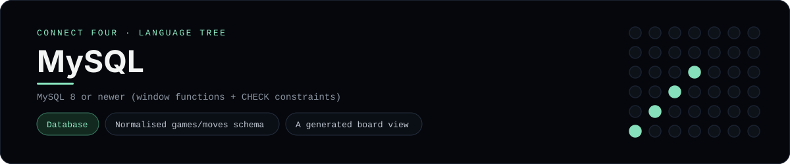

# MySQL Implementation

A Connect Four that lives in a database: `schema.sql` defines a normalised
`games`/`moves` model plus a `board_cells` view, `seed.sql` loads a scripted
game, and `queries.sql` renders the board and finds four-in-a-row with window
functions. It is a [framework showcase](../../README.md) rather than a console
language, so the dashboard shows one representative file from it (the schema)
and links the whole folder on GitHub.

## Prerequisites

* **Toolchain:** MySQL 8 or newer (the win detection uses window functions)
* **Check it is installed:** `mysql --version`

| Platform | Install command |
| --- | --- |
| Windows | `winget install Oracle.MySQL` (or `scoop install mariadb`) |
| macOS | `brew install mysql` |
| Debian/Ubuntu | `apt-get install mysql-server` |

## How to run

Load the three scripts in order against a running server:

```sh
cd frameworks/mysql
mysql -u root -p < schema.sql
mysql -u root -p < seed.sql
mysql -u root -p < queries.sql
```

`schema.sql` creates the `connect_four` database, `seed.sql` loads one finished
game, and `queries.sql` prints the board, the winning line, a leaderboard and a
per-column tally.

## How the example is built

* **Schema** - `schema.sql` keeps the model normalised: one `games` row and many
  `moves` rows, with `UNIQUE KEY`s so a turn and a cell can never be used twice,
  a foreign key with `ON DELETE CASCADE`, and `CHECK` constraints for the player
  and the 7x6 bounds. The `board_cells` view cross-joins the six rows and seven
  columns, left-joins the moves and fills the gaps with `'.'`, so the board can
  be rendered with plain SQL.
* **Seed** - `seed.sql` inserts the same short scripted game the other showcases
  use: `X` wins horizontally along the bottom row.
* **Queries** - `queries.sql` renders each board row with `GROUP_CONCAT`,
  detects every four-in-a-row by treating each move as belonging to four rays
  (horizontal, vertical and both diagonals) and grouping consecutive cells with
  `ROW_NUMBER()`, then reports a leaderboard and the per-column tally.

## Skills demonstrated

* A normalised schema with keys, a foreign key and `CHECK` constraints
* A view that materialises a board from rows and columns
* Window functions (`ROW_NUMBER()`) for gaps-and-islands win detection

## Where the full project lives

The dashboard shows the schema, `schema.sql`, and links the whole folder on
GitHub. Everything the example needs is under `frameworks/mysql/`:

```
frameworks/mysql/
  schema.sql
  seed.sql
  queries.sql
```

The showcase dashboard shows this framework's representative file when you
open the **Frameworks** browse mode, addressable at `index.html?lang=mysql`.
