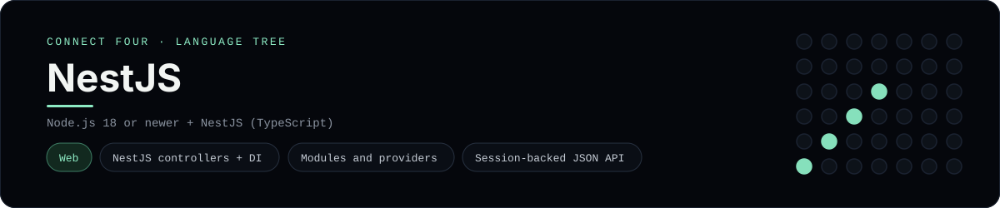

# NestJS Implementation

A small NestJS app that plays Connect Four as a JSON API - a
[framework showcase](../../README.md) alongside the console implementations in
[`languages/`](../../languages). NestJS is a Node.js server framework, so this
app answers HTTP requests with JSON instead of the byte-for-byte stdin/stdout
console protocol (and, unlike the MVC frameworks here, it has no HTML view), so
the dashboard shows one representative file from it rather than a single source
file.

## Prerequisites

* **Toolchain:** Node.js 18 or newer
* **Check it is installed:** `node --version`

| Platform | Install command |
| --- | --- |
| Windows | `winget install OpenJS.NodeJS` |
| macOS | `brew install node` |
| Debian/Ubuntu | `apt-get install nodejs` |

## How to run

Everything the app needs is under `frameworks/nestjs/`; run it from that folder:

```sh
cd frameworks/nestjs
npm init -y
npm install @nestjs/common @nestjs/core @nestjs/platform-express express-session reflect-metadata rxjs
npm install -D typescript ts-node @types/node @types/express-session
npx ts-node src/main.ts
```

The API listens on <http://localhost:3000>. Play a move and read the state back:

```sh
curl http://localhost:3000/game
curl -X POST http://localhost:3000/game/move -H "Content-Type: application/json" -d "{\"column\":4}"
curl -X POST http://localhost:3000/game/reset
```

Each reply is the current board, the move count, the `status` and an `over`
flag; the first player to line up four `X`s or `O`s wins.

## How the game is built

* **Board** - `src/game/board.ts` is plain TypeScript with the 6x7 rules:
  `drop`, `isColumnFull`, `winner` and `lowestEmptyRow`. Every update returns a
  fresh board, and both diagonals are checked from every cell, matching the win
  detection the console implementations use.
* **Controller** - `src/game/game.controller.ts` is the `@Controller("game")`:
  `GET /game` returns the state, `POST /game/move` applies a move and
  `POST /game/reset` clears it, all reading and writing the game through the
  express-session store.
* **Service** - `src/game/game.service.ts` is the injectable `GameService` that
  owns the rules and shapes the JSON response.
* **Modules** - `src/game/game.module.ts` wires the controller and provider
  together, and `src/app.module.ts` imports it; `src/main.ts` boots the app and
  registers the session middleware.

## Skills demonstrated

* NestJS controllers, providers and dependency injection
* Modules (`@Module`) and the `@Controller` / `@Get` / `@Post` decorators
* A session-backed JSON API with `express-session`
* An array-of-arrays board with diagonal win detection

## Where the full app lives

The dashboard shows the controller, `src/game/game.controller.ts`, and links the
whole folder on GitHub. Everything the app adds is under `frameworks/nestjs/`:

```
frameworks/nestjs/
  src/main.ts
  src/app.module.ts
  src/game/board.ts
  src/game/game.controller.ts
  src/game/game.service.ts
  src/game/game.module.ts
```

The showcase dashboard shows this framework's representative file when you
open the **Frameworks** browse mode, addressable at `index.html?lang=nestjs`.
