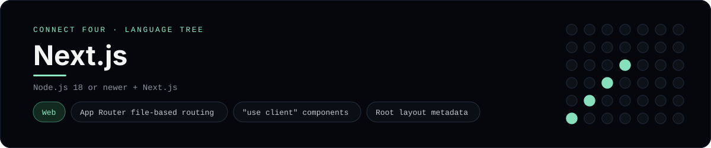

# Next.js Implementation

A small Next.js app that plays Connect Four in the browser - a
[framework showcase](../../README.md) alongside the console implementations in
[`languages/`](../../languages). Next.js is a React framework, so this app uses
App Router routes and components instead of the byte-for-byte stdin/stdout
console protocol, and the dashboard shows one representative file from it rather
than a single source file.

## Prerequisites

* **Toolchain:** Node.js 18 or newer
* **Check it is installed:** `node --version`

| Platform | Install command |
| --- | --- |
| Windows | `winget install OpenJS.NodeJS` |
| macOS | `brew install node` |
| Debian/Ubuntu | `apt-get install nodejs` |

## How to run

Generate a Next.js project and drop the app files into it (the app is a slice,
so the scaffolding comes from the CLI):

```sh
npx create-next-app@latest connectfour --js --app --no-tailwind
cp frameworks/nextjs/app/layout.jsx connectfour/app/layout.jsx
cp frameworks/nextjs/app/page.jsx connectfour/app/page.jsx
cp -r frameworks/nextjs/lib/. connectfour/lib/
cd connectfour && npm run dev
```

Then open <http://localhost:3000> and play - the board is a 6x7 grid whose
bottom row is the first to fill, and the first player to line up four `X`s or
`O`s wins.

## How the game is built

* **Board** - `lib/board.js` is plain JavaScript with the 6x7 rules: `drop`,
  `isColumnFull`, `winner` and `lowestEmptyRow`. Every update returns a fresh
  board, and both diagonals are checked from every cell, matching the win
  detection the console implementations use.
* **Page** - `app/page.jsx` is the App Router route for `/`. It is a client
  component (`"use client"`) holding the board and move count in `useState` and
  rendering the grid and column buttons.
* **Layout** - `app/layout.jsx` is the root layout: it wraps every route in
  `<html><body>` and exports the page `metadata`.

## Skills demonstrated

* Next.js App Router file-based routing (`app/page.jsx`)
* The `"use client"` directive and client/server component split
* Root layout and `metadata` export
* An array-of-arrays board with diagonal win detection

## Where the full app lives

The dashboard shows the route, `app/page.jsx`, and links the whole folder on
GitHub. Everything the app adds is under `frameworks/nextjs/`:

```
frameworks/nextjs/
  app/layout.jsx
  app/page.jsx
  lib/board.js
```

The showcase dashboard shows this framework's representative file when you
open the **Frameworks** browse mode, addressable at `index.html?lang=nextjs`.
