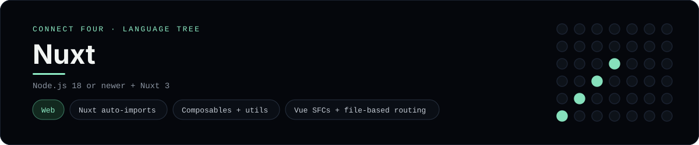

# Nuxt Implementation

A small Nuxt app that plays Connect Four in the browser - a
[framework showcase](../../README.md) alongside the console implementations in
[`languages/`](../../languages). Nuxt is the Vue meta-framework, so this app
uses Nuxt's file-based structure (auto-imported composables and utils) instead
of the byte-for-byte stdin/stdout console protocol, and the dashboard shows one
representative file from it rather than a single source file.

## Prerequisites

* **Toolchain:** Node.js 18 or newer
* **Check it is installed:** `node --version`

| Platform | Install command |
| --- | --- |
| Windows | `winget install OpenJS.NodeJS` |
| macOS | `brew install node` |
| Debian/Ubuntu | `apt-get install nodejs` |

## How to run

Generate a Nuxt project and drop the app files into it (the app is a slice, so
the scaffolding comes from the CLI):

```sh
npx nuxi@latest init connectfour
cp frameworks/nuxt/nuxt.config.js connectfour/nuxt.config.js
cp frameworks/nuxt/app.vue connectfour/app.vue
cp -r frameworks/nuxt/composables/. connectfour/composables/
cp -r frameworks/nuxt/utils/. connectfour/utils/
cd connectfour && npm run dev
```

Then open <http://localhost:3000> and play - the board is a 6x7 grid whose
bottom row is the first to fill, and the first player to line up four `X`s or
`O`s wins.

## How the game is built

* **Board** - `utils/board.js` is plain JavaScript with the 6x7 rules: `drop`,
  `isColumnFull`, `winner` and `lowestEmptyRow`. Every update returns a fresh
  board, and both diagonals are checked from every cell, matching the win
  detection the console implementations use.
* **Composable** - `composables/useConnectFour.js` is the Composition API state:
  `ref` for the board and move count, `computed` for the status, winner and
  "over" flags, and `play` / `reset` actions.
* **App** - `app.vue` calls `useConnectFour()` with no import (Nuxt auto-imports
  everything under `composables/` and `utils/`) and renders the grid and column
  buttons with `v-for`, `:class` and `:disabled`.
* **Config** - `nuxt.config.js` sets the page title through `app.head`.

## Skills demonstrated

* Nuxt auto-imports for `composables/` and `utils/`
* Vue 3 Composition API and `ref` / `computed`
* Single-file components and file-based routing
* An array-of-arrays board with diagonal win detection

## Where the full app lives

The dashboard shows the composable, `composables/useConnectFour.js`, and links
the whole folder on GitHub. (The panel highlights the composable rather than the
`.vue` files because Prism, the dashboard's highlighter, ships no Vue grammar -
the components are still in the folder on GitHub.) Everything the app adds is
under `frameworks/nuxt/`:

```
frameworks/nuxt/
  nuxt.config.js
  app.vue
  composables/useConnectFour.js
  utils/board.js
```

The showcase dashboard shows this framework's representative file when you
open the **Frameworks** browse mode, addressable at `index.html?lang=nuxt`.
