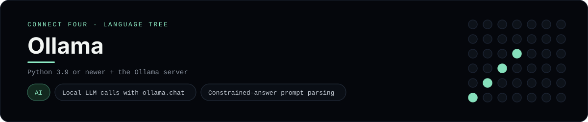

# Ollama Implementation

A small app that plays Connect Four against a local LLM served by Ollama - a
[framework showcase](../../README.md) alongside the console implementations in
[`languages/`](../../languages). Ollama runs models on your own machine, so this
app asks one for a move instead of the byte-for-byte stdin/stdout protocol, and
the dashboard shows one representative file from it rather than a single source
file.

## Prerequisites

* **Toolchain:** Python 3.9 or newer with the `ollama` package, and the Ollama
  server with a model pulled
* **Check it is installed:** `ollama --version` and `python -c "import ollama"`

| Platform | Install command |
| --- | --- |
| Windows | `winget install Ollama.Ollama` then `ollama pull llama3.2` |
| macOS | `brew install ollama` then `ollama pull llama3.2` |
| Debian/Ubuntu | `curl -fsSL https://ollama.com/install.sh | sh` then `ollama pull llama3.2` |

## How to run

Everything the app needs is under `frameworks/ollama/`; run it from that folder:

```sh
cd frameworks/ollama
pip install -r requirements.txt
ollama serve
python app.py
```

You play `X` and the model plays `O`. The board is a 6x7 grid whose bottom row
is the first to fill, and the first player to line up four `X`s or `O`s wins.

## How the game is built

* **Board** - `board.py` holds the 6x7 rules (`drop`, `is_full`, `winner`,
  `lowest_empty_row`, `legal_columns`) and a `render()` used to build the prompt.
* **App** - `app.py` runs the game loop: the model's move comes from
  `ollama.chat(...)`, whose reply is parsed with a regex for a legal column. If
  the model does not answer with one, the first legal column is used as a
  fallback, so the game never stalls.

## Skills demonstrated

* Calling a local LLM with `ollama.chat` and options
* Prompting for a constrained, single-token answer and parsing it defensively
* An interactive console game loop
* A list-of-lists board with diagonal win detection

## Where the full app lives

The dashboard shows the game loop, `app.py`, and links the whole folder on
GitHub. Everything the app needs is under `frameworks/ollama/`:

```
frameworks/ollama/
  board.py
  app.py
  requirements.txt
```

The showcase dashboard shows this framework's representative file when you
open the **Frameworks** browse mode, addressable at `index.html?lang=ollama`.
