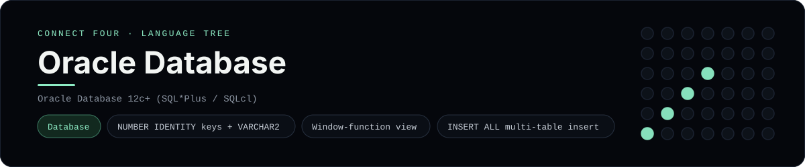

# Oracle Database Implementation

A pure-Oracle schema and seed that store Connect Four games - a
[framework showcase](../../README.md) alongside the console implementations in
[`languages/`](../../languages). Oracle is a relational database, so it answers
with result sets instead of the byte-for-byte stdin/stdout console protocol, and
the dashboard shows one representative file from it rather than a single source
file.

## Prerequisites

* **Toolchain:** Oracle Database 12c or newer with SQL*Plus (or SQLcl / Oracle
  Database Free in a container)
* **Check it is installed:** `sqlplus -V`

| Platform | Install command |
| --- | --- |
| Windows | Oracle Database Free in Docker: `docker run --name oracle -p 1521:1521 -e ORACLE_PASSWORD=... gvenzl/oracle-free` |
| macOS | Oracle Database Free in Docker (same image) |
| Debian/Ubuntu | Oracle Database Free in Docker (same image) |

## How to run

Everything the app needs is under `frameworks/oracle/`; run the scripts with
SQL*Plus:

```sh
cd frameworks/oracle
sqlplus user/pass@localhost/freepdb1 @schema.sql
sqlplus user/pass@localhost/freepdb1 @seed.sql
```

The seed plays a horizontal win for `X` through Oracle's multi-table `INSERT ALL`,
so the final `SELECT` returns the populated cells.

## How the game is built

* **Schema** - `schema.sql` models a game as a `games` row plus one `moves` row
  per turn, using `NUMBER GENERATED BY DEFAULT AS IDENTITY`, `VARCHAR2`, a
  `TIMESTAMP` default, unique/foreign/CHECK constraints, a composite index and a
  `cells` view that numbers each disc with `ROW_NUMBER() OVER (...)`.
* **Seed** - `seed.sql` inserts one game and seven moves at once with
  `INSERT ALL ... SELECT 1 FROM dual`, then selects from the view.

## Skills demonstrated

* Oracle data types and `GENERATED BY DEFAULT AS IDENTITY` keys
* Constraints, indexes and a window-function view
* Multi-table insert with `INSERT ALL`
* A query-driven `cells` view shared with the PL/SQL package

## Where the full app lives

The dashboard shows the schema, `schema.sql`, and links the whole folder on
GitHub. Everything the app needs is under `frameworks/oracle/`:

```
frameworks/oracle/
  schema.sql
  seed.sql
```

The showcase dashboard shows this framework's representative file when you
open the **Frameworks** browse mode, addressable at `index.html?lang=oracle`.
