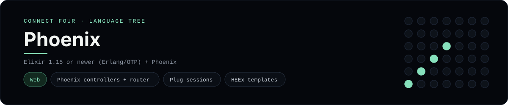

# Phoenix Implementation

A small Phoenix app that plays Connect Four in the browser - a
[framework showcase](../../README.md) alongside the console implementations in
[`languages/`](../../languages). Phoenix is a web framework for Elixir, so this
app serves server-rendered HEEx views instead of the byte-for-byte
stdin/stdout console protocol, and the dashboard shows one representative file
from it rather than a single source file.

## Prerequisites

* **Toolchain:** Elixir 1.15 or newer (with Erlang/OTP) and the Phoenix archive
* **Check it is installed:** `elixir --version` and `mix phx.new --version`

| Platform | Install command |
| --- | --- |
| Windows | `winget install Erlang.ErlangOTP` then `winget install Elixir.Elixir` then `mix archive.install github phoenixframework/phoenix` |
| macOS | `brew install elixir` then `mix archive.install github phoenixframework/phoenix` |
| Debian/Ubuntu | `apt-get install elixir` then `mix archive.install github phoenixframework/phoenix` |

## How to run

Generate a Phoenix project and drop the app files into it (the app is a slice,
so the scaffolding comes from the generator):

```sh
mix phx.new connectfour --no-ecto
cp frameworks/phoenix/lib/connect_four/game.ex connectfour/lib/connect_four/game.ex
cp -r frameworks/phoenix/lib/connect_four_web/. connectfour/lib/connect_four_web/
cd connectfour && mix phx.server
```

Then open <http://localhost:4000> and play - the board is a 6x7 grid whose
bottom row is the first to fill, and the first player to line up four `X`s or
`O`s wins.

## How the game is built

* **Game** - `lib/connect_four/game.ex` is the engine: a struct with the 6x7
  cells and the rules `drop`, `full?`, `winner`, `over?` and `status`, plus
  `from_session` / `to_session` so it round-trips through the Plug session. Both
  diagonals are checked from every cell, matching the win detection the console
  implementations use.
* **Controller** - `lib/connect_four_web/controllers/game_controller.ex` keeps
  the game in the session, validates the chosen column, applies the move and
  redirects back (post/redirect/get), so a refresh never re-plays a move.
* **Router** - `lib/connect_four_web/router.ex` pipes the browser routes through
  `:fetch_session` and `:protect_from_forgery` and maps `board`, `move` and
  `reset`.
* **Template** - `.../game_html/board.html.heex` renders the board (top row
  first) and the column buttons, with the CSRF token in each form.

## Skills demonstrated

* Phoenix controllers, router pipelines and verified routes (`~p"/"`)
* Plug sessions and post/redirect/get
* HEEx templates and CSRF protection
* An Elixir structured board with diagonal win detection

## Where the full app lives

The dashboard shows the controller,
`lib/connect_four_web/controllers/game_controller.ex`, and links the whole
folder on GitHub. Everything the app adds is under `frameworks/phoenix/`:

```
frameworks/phoenix/
  lib/connect_four/game.ex
  lib/connect_four_web/controllers/game_controller.ex
  lib/connect_four_web/controllers/game_html/board.html.heex
  lib/connect_four_web/router.ex
```

The showcase dashboard shows this framework's representative file when you
open the **Frameworks** browse mode, addressable at `index.html?lang=phoenix`.
